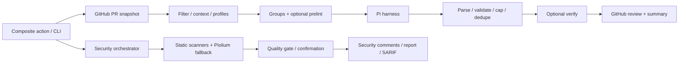

# Source audit and deep research — action-code-review

## 1. Conclusion and scope

The action has a solid foundation for growing into an in-depth reviewer: GitHub context, Pi repository reading, review grouping, stack-specific skills, validation/dedupe, GitHub inline review, a verify pass, and a separate security pipeline. However, **this snapshot does not yet provide enough basis to call it an excellent reviewer or better than Copilot**. The major problems lie at execution boundaries, turning errors into clean results, finding evidence, and UI honesty. Adding more prompts or agent passes before fixing these points will make the system more complex without proving quality.

The audit covers **73 `src/` files, 9,326 lines**, action manifests, workflows, build configuration, skills, and architecture/contract/security documentation; the full test suite was run, and key tests were traced along data paths. Snapshot **`f59cfc34f385d89754814f7b3649b7004fe7faa4`** is HEAD and `origin/main` after a fetch on **09/12/2026**; the latest commit is dated 09/08/2026, `test(context): cover groupByArea routing (#110)`. [Inventory with per-file SHA-256](source-inventory.json) enables exact scope cross-checking. Both bundles were rebuilt into a temporary directory; product logic is unchanged.

This report covers **audit + research + execution planning** on the snapshot above. After the audit, the working tree partially implemented Phase A and re-ran regression/build; the baseline report below still describes the pre-fix defects to preserve traceability. There is no measured live API/Copilot benchmark or exploit execution; the results are not a safety certification or a completeness claim for every repository.

### Post–Phase A fix status

The main false-clean paths have been blocked: review/verify retain candidates when parse or verdict output is incomplete; the summary distinguishes complete from incomplete/failed; capping happens after validate/rank; unknown categories are preserved for policy handling; Pi disables extension/skill/context discovery and selects the final structured message; deadlines cover body parsing and timeout kills the whole process group; suggestion code is no longer HTML-escaped; the quality gate checks path/range; the security engine/publisher preserve error state and PR identity; pagination marks truncated scope; rule coverage no longer infers “passed” from silence. The regression suite is now **48 test files / 438 tests**, with typecheck/Biome/both-bundle builds/smoke guards all passing. This is correctness hardening, not competitive-quality evidence; the benchmarks and remaining P0/P1 items in the roadmap are still mandatory.

“There is nothing left to update” is not a feasible end condition: stacks, APIs, vulnerabilities, and competitors keep changing. Replace it with a release that has a clear support scope, all quality gates met, no known blockers, and a regression-measurement process. [Roadmap](improvement-roadmap.md) makes that condition concrete.

## 2. Verification evidence

| Check | Result | What this result proves |
|---|---|---|
| Remote sync | Fetch succeeded; HEAD = origin/main | Audit ran on the latest main source at check time |
| `pnpm install --frozen-lockfile` | Succeeded | Dependencies follow the lockfile; no manifest/lockfile changes |
| `pnpm test` | **48 test files, 431 tests passing** | Current assertions pass; does not prove LLM precision/recall |
| `pnpm typecheck` | Pass | Current TypeScript checks pass |
| `pnpm lint` | Pass, 121 files | Biome source/test checks pass |
| ncc build of both entries | Pass | Source produces bundles at `/tmp/acr-audit-pr-review` and `/tmp/acr-audit-pr-content` |
| `node --check` on both bundles | Pass | Bundles have valid syntax on the audit environment's Node 22.23.2 |
| Bundle smoke, clean env, `GITHUB_ACTIONS=true` | Both entries start and exit 1 with “This action only runs on pull requests” | Input guard runs; **not** a successful review smoke test with GitHub/LLM |
| Packaged skills vs `skills/*/SKILL.md` | 9/9 match | No drift seen in this snapshot; a generator/check is still needed going forward |
| Local witnesses | **19 witnesses passing: 16 local behaviors, 3 static config checks** | Reproduce specific defect paths; not a review-quality benchmark |

Reproduce after installing dependencies:

```bash
node docs/research/reproduce.mjs > docs/research/reproduction-results.json
```

[Script](reproduce.mjs) transpiles source into a temporary directory, uses fake harness/fetch/Octokit and synthetic tokens, and cleans up fixtures afterwards. [Machine-readable results](reproduction-results.json) record each ID. Assertions intentionally describe **snapshot defects**, not regression tests for the fix. When fixing source, replace each corresponding witness with a test expecting correct behavior.

Notable point: current verify tests still assert that malformed output is handled “gracefully” by dropping a critical finding. So 431 green tests can coexist with a severe defect. Build/smoke also emit a `punycode` deprecation warning; that is dependency maintenance, not a review-quality blocker.

## 3. Audited architecture



The two pipelines share no common contract for completion state, evidence, cancellation, publication, and usage. That explains why the same provider error surfaces differently: review records a failed group while the summary still looks clean; security catches an error then returns risk none; the audit fallback can even reject before the caller catches it.

| Subsystem | Source assessment | Development direction |
|---|---|---|
| `entry/`, `adapter/`, manifests | Separate entries; has input contract and Pi pin. Model capabilities/cost hardcoded; runtime isolation does not cover project resources | Typed config, capabilities, trusted resource loader, artifact verification |
| `cli.ts`, `modes/` | Centralized orchestration, but many mappings/wrappers and implicit state; advertised `agent` is not yet a code-fix workflow | Thin adapter + review/security/fix application services; contract matrix per input |
| `context/` | Has pagination, filters, diff parsing, repository hints, prelint | Consistent base/head snapshot, coverage ledger, selective retrieval, safe analyzer execution |
| `harness/`, `llm/` | Pi has read tools; compatible endpoint is easy to use. JSON text parsing and transport under-handle refusal/truncation/events | Structured contract, protocol adapter, budgets, cancellation, capability negotiation |
| `review/` | Has bounds validation, dedupe, severity caps. Verify/conflict/cap/coercion can drop or misinterpret findings | Evidence-first validation, explicit verdicts, cap after validate/rank, preserve raw candidates |
| `github/` | Batch review, fallback, actor filtering, useful buffer and summary | Honest publication state, exact suggestions, GraphQL threads, head race protection, idempotency |
| `profiles/`, `skills/` | 9 skills match mirror; SQL detection has guard. CLI defaults to all profiles with skills instead of detect results | Stack/version routing, rule provenance, single generation source, per-stack evaluation |
| `security/engines/`, orchestrator | Has abstraction and confirmation; deep path does not guarantee native audit runs | Engine health contract, separate diff/full-audit scope, shared sandbox, genuine profile semantics |
| Scanners/classifier/skills | Risk-domain routing is useful; secret/dependency scans narrow, Semgrep environment-dependent | Pinned scanners/rules, lockfile SCA, scanner diagnostics, exact evidence semantics |
| Findings/quality gate/redaction | Has normalization/fingerprint/redaction, but model self-reports confirmed and evidence is unverified | Trusted provenance, structured redaction at every sink, verified evidence references |
| Reporters/SARIF | Has artifact and sticky/inline reporting | Dedupe/pagination/authorship, native fingerprints, upload workflow, partial failure visibility |
| Tests/build/workflow/docs | Broad suite, useful contract tests and e2e mocks; self-review workflow does not run quality CI | Regression corpus, sandboxed GitHub integration, clean build gate, benchmark/release discipline |

## 4. Priority findings to fix

**P0**: execution boundaries involving credentials must be handled before use on untrusted PRs. **P1**: causes missed critical issues, wrong results, or untrustworthy published information. **P2**: reliability, integration, or config work to complete. Priority is a rollout recommendation; not a conclusion of production exploitation.

### F01 — P0: Pi auto-loads resources from the repository across the read-only boundary

**Source:** [harness/pi.ts:79](https://github.com/niko0xdev/action-code-review/blob/f59cfc34f385d89754814f7b3649b7004fe7faa4/src/harness/pi.ts#L79), [adapter/runtime.ts:14](https://github.com/niko0xdev/action-code-review/blob/f59cfc34f385d89754814f7b3649b7004fe7faa4/src/adapter/runtime.ts#L14). **High confidence; source analysis + pinned upstream; witness `F01-static`.**

`buildPiArgs` keeps extension/skill discovery for built-in skills; it only disables context files/prompt templates. Pi 0.73.1 auto-loads `.pi/extensions`, and extensions get full OS execution rights.[^1] Inspecting the correctly pinned package shows project settings/packages are still resolved before extension filtering; `.pi/SYSTEM.md`/`APPEND_SYSTEM.md` also have their own discovery. The temporary `PI_CODING_AGENT_DIR` only isolates agent-side config; it does not turn the repository into passive data.[^2]

**Trigger:** a PR places an extension or project resource into the workspace where Pi runs; the process holds API credentials. No model bash-tool choice is needed for a startup extension to execute. This capability is established via code path, without exploit attempts. Disabling `--no-extensions` alone is not a complete fix because package resolution and other resources must still be controlled.

**Fix:** use an explicit trusted resource loader or a clean data workspace; only pinned built-in skills; block project packages/extensions/system overrides; sandbox filesystem/network/process; realpath-constrain read tools, block credentials and `.git/config`. **Acceptance:** adversarial fixtures for each discovery path execute no code/read no secrets; trusted plugins require explicit opt-in under a separate policy.

### F02 — Conditional P0: prelint executes workspace binaries/configs with runner env

**Source:** [context/prelint.ts:83](https://github.com/niko0xdev/action-code-review/blob/f59cfc34f385d89754814f7b3649b7004fe7faa4/src/context/prelint.ts#L83). **High confidence on code path; witness `F02-static`, no malicious binary executed.**

`findBinary` prefers `repositoryPath/node_modules/.bin`; the subprocess has no sanitized env. If a consumer enables prelint and the workspace contains PR-controlled binaries/configs/plugins, “read-only review” becomes code execution with credentials. The repository workflow enables prelint without installing dependencies, so many analyzers may simply skip. Risk is especially high in workflows with secrets/write tokens processing untrusted PR code; GitHub documents this boundary in its Actions guidance.[^3]

**Fix:** provision binaries from a trusted path, an allowlisted config that loads no arbitrary plugins, a minimal environment, read-only mounts, and no credentials/network for analyzers. **Acceptance:** fake workspace binaries are rejected; missing analyzers show as skipped; a failed required analyzer makes the review incomplete. Do not run PR install scripts just to “enable enough tools”.

### F03 — P1: malformed verify JSON deletes high/critical findings and drops risk to none

**Source:** [review/verify.ts:299](https://github.com/niko0xdev/action-code-review/blob/f59cfc34f385d89754814f7b3649b7004fe7faa4/src/review/verify.ts#L299). **High confidence; witness `F03`.**

Unparseable JSON returns `{ verified: [] }`; the caller treats that as a valid verdict and drops all high/critical findings. A fixture with one critical plus non-JSON output yields remaining 0, dropped 1, risk none. Caught exceptions are distinct from malformed responses, so this cannot be called “fail-safe verify”. The verify prompt only supplies the claim and a filename list, without enough patch/source to check; the same model provides no independent evidence on its own.

**Fix:** distinguish `valid verdict`, `refused`, `incomplete`, `parse_error`, `timeout`; errors retain candidates and record unverified state. Stable IDs per finding; drop only on explicit refutation with base/head evidence. **Acceptance:** schema/refusal/partial-verdict errors never make a critical disappear; verify sees files beyond the first 20; keep a kept/refuted/uncertain/error ledger. Structured Outputs help with schema, not with finding correctness.[^4]

### F04 — P1: summary claims APPROVED when review is incomplete

**Source:** [github/comments.ts:96](https://github.com/niko0xdev/action-code-review/blob/f59cfc34f385d89754814f7b3649b7004fe7faa4/src/github/comments.ts#L96), [github/review.ts:318](https://github.com/niko0xdev/action-code-review/blob/f59cfc34f385d89754814f7b3649b7004fe7faa4/src/github/review.ts#L318). **High confidence; witness `F04`.**

The publisher already has a failed-group guard so it never actually APPROVEs; that part is correct. But the renderer still prints APPROVED and “All clear… Approving” when findings are empty, without showing failedGroups. It also presents category/rule passes with no execution proof. Users reading the banner will misunderstand the real result, even when the GitHub review is only COMMENT due to permission or policy.

**Fix:** separate assessment, completeness, and publication. `complete_clean`, `complete_issues`, `incomplete`, `failed`, `stale`, `skipped` each have distinct semantics; render the actual event after publish. **Acceptance:** errored groups, missing context, denied writes, and stale heads never display approved/fully checked. Coverage must explain no-patch, excluded, budget-limited, and failed separately.

### F05 — P1: HTML escaping corrupts code in suggestions

**Source:** [github/comments.ts:45](https://github.com/niko0xdev/action-code-review/blob/f59cfc34f385d89754814f7b3649b7004fe7faa4/src/github/comments.ts#L45), [github/suggestions.ts](https://github.com/niko0xdev/action-code-review/blob/f59cfc34f385d89754814f7b3649b7004fe7faa4/src/github/suggestions.ts). **High confidence; witness `F05`.**

`mdSafe` is applied to `replacement`, then placed into a fenced suggestion. `<`, `>`, `&`, and quotes become HTML entities while the code fence stays literal: applying the suggestion changes the code. The max-10-line replacement also lacks a range/hash contract; a single-line publisher anchor does not guarantee a multi-line intended replacement is correct.

**Fix:** escape prose separately; preserve exact code bytes; prevent fence closing; record original range + head blob hash + expected text; publish a code patch only if application is verifiable. **Acceptance:** roundtrips of JSX, generics, quotes, operators, Unicode, and multiline suggestions preserve bytes; degrade to prose when unverifiable.

### F06 — P1: missing redaction at publication sinks and raw agent debug

**Source:** [github/comments.ts:10](https://github.com/niko0xdev/action-code-review/blob/f59cfc34f385d89754814f7b3649b7004fe7faa4/src/github/comments.ts#L10), [harness/pi.ts:178](https://github.com/niko0xdev/action-code-review/blob/f59cfc34f385d89754814f7b3649b7004fe7faa4/src/harness/pi.ts#L178), [security/redaction/redactor.ts](https://github.com/niko0xdev/action-code-review/blob/f59cfc34f385d89754814f7b3649b7004fe7faa4/src/security/redaction/redactor.ts). **High confidence; witness `F06` uses synthetic tokens.**

Finding bodies only escape Markdown/HTML; the debug section puts stdout/stderr into the step summary. Fixture tokens appear verbatim in both. Input scrubbing is useful but does not cover sources the agent reads via tools or model/tool/log output. Security redaction on raw JSON before parsing can also break structured content; bounded regexes risk leaving long-credential suffixes. Do not treat the raw event log as default content suitable for the summary.

**Fix:** central structured redaction before every sink: comment, review body, output, summary, SARIF, artifact, exception/log; exact registered-secret replacement combined with detectors; logs default to filtered metadata/evidence only, raw traces under separate access/retention. **Acceptance:** canary secrets across all sources/sinks, long tokens, multiline private keys, encoded variants, and malformed output; no secret leaks, no broken JSON.

### F07 — P1: custom review prompt never reaches Pi

**Source:** [cli.ts:694](https://github.com/niko0xdev/action-code-review/blob/f59cfc34f385d89754814f7b3649b7004fe7faa4/src/cli.ts#L694), [review/reviewer.ts:26](https://github.com/niko0xdev/action-code-review/blob/f59cfc34f385d89754814f7b3649b7004fe7faa4/src/review/reviewer.ts#L26), [harness/pi.ts:228](https://github.com/niko0xdev/action-code-review/blob/f59cfc34f385d89754814f7b3649b7004fe7faa4/src/harness/pi.ts#L228). **High confidence; witness `F07` captures fake-Pi stdin.**

The CLI passes `promptFile`/`reviewPrompt` into `runReview.options.extraRules`; `runReview` never uses that option. Pi only uses constructor extraRules, created earlier from profiles/security. Users believe custom rules apply when they do not. Prompt-file containment currently checks lexical paths then stats/reads through symlinks; it needs realpath when rewiring.

**Fix:** a single typed prompt-assembly service with clear trust/provenance per policy source; pass rules through the harness request instead of an implicit constructor. **Acceptance:** test from action input to final request; customizations appear in the prompt manifest; symlinks outside root are rejected, unread rules are never marked applied.

### F08 — P1: security deep does not guarantee a deep audit; failure is unexpressed

**Source:** [security/engines/piolium-engine.ts:24](https://github.com/niko0xdev/action-code-review/blob/f59cfc34f385d89754814f7b3649b7004fe7faa4/src/security/engines/piolium-engine.ts#L24), [security/engines/pi-security-engine.ts:210](https://github.com/niko0xdev/action-code-review/blob/f59cfc34f385d89754814f7b3649b7004fe7faa4/src/security/engines/pi-security-engine.ts#L210), [security/orchestrator.ts:50](https://github.com/niko0xdev/action-code-review/blob/f59cfc34f385d89754814f7b3649b7004fe7faa4/src/security/orchestrator.ts#L50). **High confidence; witness `F08` for diff + inspection audit.**

The adapter optionally imports `@vigolium/piolium` then awaits a `runAudit` function; that dependency is absent from the manifest. The 0.0.13 package inspected at audit time ships CLI/extensions with no exported `runAudit` entry matching the assumed contract.[^5] Without a custom compatible module, lite/balanced/deep fallbacks all become `PiSecurityEngine.diff`. With an API key, this engine calls chat completion on the diff, not Pi repository exploration. The `confirm` profile maps to balanced; manual/scheduled audits with no changed files do not create a full-repo scope on their own.

A diff provider outage is caught and then concluded as findings 0/risk none, with no engine failure field. Separately, the audit fallback `return fallbackEngine.diff(ctx)` passes through `finally await rm(...)` without awaiting the promise: the first reproduce run on Node 22 exited with an unhandled rejection before the orchestrator catch handled it. The stable witness switches to diff to measure fail-open behavior separately, without merging two results into one claim.

The keyless CLI fallback also lacks the main harness's tool/resource/env restrictions, timeout/output caps, and event extraction.

**Fix:** verify the native API/CLI at the correct pin or implement native audit via the Pi SDK; profiles with observable scope/budget/phases; shared sandbox/protocol/transport; `return await` before async cleanup; mandatory engine health in conclusions. **Acceptance:** a deep fixture with an issue in a file outside the diff; API outage returns incomplete; missing adapters never silently downgrade; CLI fallback has the same security guarantees; confirm only verifies input candidates.

### F09 — P1: security “validated” does not guarantee valid file/line/evidence

**Source:** [security/validators/quality-gate.ts:39](https://github.com/niko0xdev/action-code-review/blob/f59cfc34f385d89754814f7b3649b7004fe7faa4/src/security/validators/quality-gate.ts#L39), [security/findings/normalizer.ts](https://github.com/niko0xdev/action-code-review/blob/f59cfc34f385d89754814f7b3649b7004fe7faa4/src/security/findings/normalizer.ts). **High confidence; witness `F09`.**

The gate mostly checks filename membership when allowedFiles is non-empty, confidence, presence of an evidence item, and severity. A fixture with `startLine=999999`, `endLine=2`, and reasoning-only evidence still passes as validated. Findings with no file can also pass; empty scope constrains no paths. The model can self-report `confirmed` plus IDs/fingerprints that downstream code trusts.

**Fix:** schema + path canonicalization + blob/range/hunk checks; host-generated IDs/provenance; separate reported confidence, calibrated confidence, and independently confirmed evidence. Diff inline scope differs from audit-report scope. **Acceptance:** impossible ranges/paths, nonexistent files, and forged confirmations are rejected; evidence excerpts match the pinned blob; summary-only findings have an explicit reason, never assumed inline-valid.

### F10 — P1: conflict heuristic drops two independent bugs

**Source:** [review/validator.ts](https://github.com/niko0xdev/action-code-review/blob/f59cfc34f385d89754814f7b3649b7004fe7faa4/src/review/validator.ts). **High confidence; witness `F10`.**

Two nearby findings in the same category, one containing add/missing/should and one containing remove/delete, are inferred as contradictory. A fixture pair — “add tenant filter” and “remove hardcoded admin bypass” — are two issues needing simultaneous fixes, but only one survives. Keyword polarity does not establish the same invariant or the same proposed change.

**Fix:** dedupe by defect identity/evidence/invariant; on genuine conflict, keep candidates unresolved and verify them instead of deleting by lexical confidence ranking. **Acceptance:** independent add/remove pairs in the same file are kept; duplicate-paraphrase merges lose no evidence; real contradictions carry a reason + ledger.

### F11 — P1: concatenating every assistant message_end corrupts final JSON

**Source:** [harness/pi.ts:140](https://github.com/niko0xdev/action-code-review/blob/f59cfc34f385d89754814f7b3649b7004fe7faa4/src/harness/pi.ts#L140). **High confidence; witness `F11`.**

`extractAssistantText` concatenates text from every assistant message_end. If an exploration turn and the final turn both contain JSON, extraction from the first `{` to the last `}` is unparseable. Multi-turn agents need a protocol adapter with a terminal artifact, not a merge of all assistant speech. Stop reason/error must also be expressed.

**Fix/acceptance:** select the final successful structured result or a dedicated output tool; fixtures for reasoning/tool turns/intermediate JSON/final JSON/error-after-text/truncation all get correct states, never turn into clean.

### F12 — P1: schema-invalid findings treated as an empty list

**Source:** [harness/harness.ts:99](https://github.com/niko0xdev/action-code-review/blob/f59cfc34f385d89754814f7b3649b7004fe7faa4/src/harness/harness.ts#L99). **High confidence; witness `F12`.**

`{"summary":"ok","findings":"invalid"}` is accepted as empty findings. Partially invalid entries are coerced/dropped without complete malformed diagnostics. This is a false-clean boundary, not just a lenient parser.

**Fix/acceptance:** strict versioned schema, one bounded repair if the provider allows; failed repair => incomplete; invalid-entry statistics; never use a default empty array for an invalid response.

### F13 — P1: rule coverage “passed” is inferred, not measured

**Source:** [review/reviewer.ts:144](https://github.com/niko0xdev/action-code-review/blob/f59cfc34f385d89754814f7b3649b7004fe7faa4/src/review/reviewer.ts#L144). **High confidence; witness `F13`.**

Total is the bullet count in rules; passed = total minus unique finding rule IDs. A fake harness returning empty yields 4/4 rules “passed” with no evidence they were checked. Category tables reuse the same ratio. No findings does not mean rules were successfully checked.

**Fix/acceptance:** execution ledger with `assessed_with_evidence`, `issue_found`, `not_assessed`, `unsupported`, `error`; separate deterministic checks from LLM areas explored; never render arithmetic passed/coverage without measurement.

### F14 — P2: security comment dedupe missing pull_number

**Source:** [security/reporters/security-publisher.ts:180](https://github.com/niko0xdev/action-code-review/blob/f59cfc34f385d89754814f7b3649b7004fe7faa4/src/security/reporters/security-publisher.ts#L180), [cli.ts:156](https://github.com/niko0xdev/action-code-review/blob/f59cfc34f385d89754814f7b3649b7004fe7faa4/src/cli.ts#L156). **High confidence; witness `F14`.**

The publisher calls listCommentsForReview without `pull_number`, while the CLI wrapper requires this field. The exception is swallowed, existing IDs become empty, and already-posted findings publish again. The real endpoint also needs the PR number.[^6] Security pagination covers only the first 50 reviews/100 comments per review; sticky covers only the first page; marker authorship is not controlled like the main pipeline.

**Fix/acceptance:** typed endpoint request, pagination, actor-owned markers, and stable IDs; reruns on the same SHA create no new comments; human-spoofed markers neither suppress findings nor get updated.

### F15 — P2: PR file pagination stops at 1,000 without reporting a gap

**Source:** [context/pr.ts:60](https://github.com/niko0xdev/action-code-review/blob/f59cfc34f385d89754814f7b3649b7004fe7faa4/src/context/pr.ts#L60). **High confidence; witness `F15`.**

Default is 10 pages × 100 files; there is no truncated flag. The GitHub endpoint supports up to 3,000 files, which still has its own limit.[^7] A fixture with always-full pages receives 1,000 then stops while context reports no gap. This is independent of the max-files review filter: collection must know the full corpus before applying policy.

**Fix/acceptance:** reconcile `changed_files`, pagination/Link, and local base/head diff; if the full set cannot be fetched, mark incomplete with numerator/denominator; fixtures at 1,001 and >3,000, plus rename/delete/binary/patch-omitted cases, must not be lumped together as “excluded by filter”.

### F16 — P2: provider timeout only guards time-to-response-headers

**Source:** [llm/openai-compatible.ts:55](https://github.com/niko0xdev/action-code-review/blob/f59cfc34f385d89754814f7b3649b7004fe7faa4/src/llm/openai-compatible.ts#L55). **High confidence; witness `F16`.**

The timer is cleared in a finally around fetch, before `response.json()`/error body. A fixture with a 5ms timeout and 40ms body delay still returns ok with the signal unaborted. Response bodies have no size cap; direct calls lack comprehensive classified retry/backoff/Retry-After handling.

**Fix/acceptance:** deadline covers body parse/stream, aborts the socket, and caps bytes; retry only transient errors with bounded jitter + total budget; no unnecessary retries on bad schema/auth. Test delayed bodies, 429/503, 401, oversized/invalid JSON, and cancellation.

### F17 — P1: slicing before rank/validation drops trailing critical findings

**Source:** [review/reviewer.ts:69](https://github.com/niko0xdev/action-code-review/blob/f59cfc34f385d89754814f7b3649b7004fe7faa4/src/review/reviewer.ts#L69). **High confidence; witness `F17`.**

`findings.slice(0, overallLimit)` runs before per-severity caps and validation. A fixture of 20 lows + 1 critical loses the critical. Invalid entries in the prefix can also displace later valid findings. Presentation caps must not change risk substance or delete detections from artifacts.

**Fix/acceptance:** parse a safe bounded maximum, validate all candidates within the limit contract, rank/dedupe, then cap publication; retained full findings/hidden count/risk based on assessed findings. Permuting output order must not change critical recall or conclusions.

### F18 — P2: unknown category mapped to correctness before bucket-low policy

**Source:** [harness/harness.ts:131](https://github.com/niko0xdev/action-code-review/blob/f59cfc34f385d89754814f7b3649b7004fe7faa4/src/harness/harness.ts#L131), [review/reviewer.ts:99](https://github.com/niko0xdev/action-code-review/blob/f59cfc34f385d89754814f7b3649b7004fe7faa4/src/review/reviewer.ts#L99). **High confidence; witness `F18`.**

The parser converts unknown categories to correctness while keeping critical; downstream normalization never sees unknown to apply the documented bucket-low rule. Rule/provenance is misinterpreted, and isolated docs/tests miss the composition.

**Fix/acceptance:** preserve the original enum + validation diagnostic or reject the schema; one place decides compatibility policy; cross-layer tests for unknown/legacy categories through parser→reviewer→publisher. Never use an unknown category to lower the severity of a proven vulnerability on its own.

### F19 — P1: Pi timeout cancels SIGKILL escalation immediately after arming it

**Source:** [harness/pi.ts:275](https://github.com/niko0xdev/action-code-review/blob/f59cfc34f385d89754814f7b3649b7004fe7faa4/src/harness/pi.ts#L275), [harness/pi.ts:35](https://github.com/niko0xdev/action-code-review/blob/f59cfc34f385d89754814f7b3649b7004fe7faa4/src/harness/pi.ts#L35). **High confidence from source; witness `F19-static` checks args only, not process termination.**

Timeout sends SIGTERM, sets a 250ms killTimer, then calls `finish(error)` immediately; finish clears killTimer. A process ignoring SIGTERM can continue, and detached descendants are not managed by child.kill on the parent. The controller reports stopped while compute/network may still run.

The argument allowlist also accepts `--max-duration`, which the correctly pinned upstream parser does not support; `--model-override` and model config need typed semantics. Because spawn args avoid a shell, this is **not shell-injection evidence**.

**Fix/acceptance:** terminate the process group/session with grace + escalation, reap/close before cleanup; review-wide timeout; atomic parser for options matching the pinned protocol only. A harmless fixture ignoring SIGTERM plus a child descendant proves no process remains after the deadline; Windows needs an equivalent mechanism.

### F20 — P1: unresolved-thread lookup uses a REST route absent from the GitHub contract

**Source:** [cli.ts:173](https://github.com/niko0xdev/action-code-review/blob/f59cfc34f385d89754814f7b3649b7004fe7faa4/src/cli.ts#L173), [github/review.ts](https://github.com/niko0xdev/action-code-review/blob/f59cfc34f385d89754814f7b3649b7004fe7faa4/src/github/review.ts). **High confidence from integration contract; no live GitHub calls made.**

The wrapper paginates `GET /repos/{owner}/{repo}/pulls/{pull_number}/threads`. Thread resolution is GraphQL `reviewThreads`/`PullRequestReviewThread.isResolved` data, not this REST route in the pulls review API.[^6][^8] Auto-approve-when-resolved therefore lacks the advertised correct integration; fake tests do not catch the wrong endpoint.

**Fix/acceptance:** GraphQL pagination + author/ID/head association; lookup failure => unknown, never conclude all resolved. Resolving a thread is a workflow signal, not proof a bug is fixed. Sandbox integration tests with unresolved/resolved/outdated/human threads, reruns/new heads, and permission failures.

## 5. Other gaps for the backlog

| Gap | Consequence | Proposal |
|---|---|---|
| Default gpt-4, max-files 10, critical-only, JSON/YAML exclusion | Default experience skips many high/medium findings and workflow/dependency/config | Keep v1 contract; add new preset/version, docs migration; config/security not excluded by default in the new preset |
| Profile detection completes but CLI defaults to all nine built-ins | Overbroad prompt; SQL profiles not loaded under this default | Detect stack + actual dependency versions; select rules by changed symbols/risk, record reason |
| Context truncated by chars after join | May cut hunks mid-way; rules/title/body/tool evidence outside budget | Token-aware global allocator, complete fragments, retrieval budget, and coverage ledger |
| Include-full-content is a tool instruction, not inspect proof | Files-reviewed based on group success may be over-optimistic | Log inspected blobs/ranges and task scope; never promise full context from a boolean |
| Model config fixed to chat API, reasoning false, 128k/16k, zero cost | Does not reflect real model/gateway; budget/telemetry untrustworthy | Provider capabilities + model snapshot registry; actual usage/cost; unknown cost must read unknown |
| Verify USD estimate uses fixed price, not pipeline actuals | Ceiling does not bound total spend | Budget reserve, usage ledger, and model-aware estimation; include cached/reasoning/tool/retry overhead |
| `mode: auto/agent`, riskThreshold, security Pi args/progress lack full semantics | Inputs accepted but user expectations unmet | Input-to-behavior contract tests; explicit unsupported/degraded states, implement each mode |
| Semgrep runs without explicit config; errors/skips may read as clean | Environment-dependent, rule coverage not reproducible | Pin binary/rules/checksum, explicit `--config`; record config digest, execution errors.[^9] |
| CodeQL is a status hook, dependency scan mostly package.json regex | Not yet full CodeQL ingestion/SCA vulnerability analysis | SARIF ingestion + license/resource docs; lockfile-resolved OSV advisory queries.[^10] |
| Wildcard deps labeled confirmed despite theoretical exploitability | Conflates exact pattern detection with proven vulnerability | Separate verified-detector match; security severity needs threat model + lockfile/call path |
| SARIF fingerprint only in properties | Limits code-scanning dedupe/interop | Standard native fingerprints, schema validation, workflow upload per permission |
| PR content update lacks optimistic-conflict protection for human edits | May overwrite description/title changed during generation | Managed section/preview; re-fetch and compare before update; preserve human checklist; bounded retry/incomplete guard |
| GitHub publish lacks consistent final head recheck | Review/approval on a stale snapshot while the PR changes mid-run | Pin checkout/API head, re-fetch before publish, stale-result artifact; controlled rerun |
| Workflow currently AI self-review only | Repo tests/lint/build not yet required quality CI | Secretless CI for PR code; unit/integration/contract/build-dist gates; separate trusted reviewer workflow |
| Global npm Pi + regex version guard + unquoted action path | Loose trusted provisioning/portability | Controlled toolcache, exact version/integrity verification; quote path; offline/pinned release docs |
| Skills mirror currently correct but build generates/checks no mirror | Easy drift after edits | One authoritative source + generator + CI byte check; stack rule revisions and eval cases in the same PR |

## 6. Deep research: competitor and technique baseline

### Copilot at research time

Copilot code review now uses full-project context, supports auto review on push, and hands findings to a cloud agent that opens PRs; GitHub describes a model mix serving review, with no user model choice.[^11] The reviewer also uses repository skills and MCP; MCP configuration has a read-only tool annotation gate.[^12][^13] The cloud agent has an Actions environment for fixing features/bugs, running tests/linters, and opening PRs.[^14] Default review is COMMENT; approval preview has separate configuration and must be compared in the right mode.[^15]

So “has agent, whole-repo context, skills, MCP, autofix” is **not a differentiator**. This action's worthwhile bets are re-checkable evidence, measured confidence, self-host/custom endpoints, transparent cost control, and policy-driven workflows. This is the audit's product hypothesis, not a benchmark result.

| Capability | Action snapshot | Copilot baseline / competitive requirement |
|---|---|---|
| PR inline review | Present, but F04/F05/F14 affect trust | Correct integration, low-noise comments with sufficient evidence |
| Repository context | Pi read tools; scope/coverage unclear | Full context exists; action needs better selective evidence retrieval[^11] |
| Rules/skills | 9 stack skills; custom wiring broken | Skills exist; need rule versioning/provenance/eval[^13] |
| External context | No controlled MCP review path yet | MCP exists; add allowlist + egress policy + source citations[^12] |
| Fix workflow | `agent` is not yet a safe fix pipeline | Cloud agent has tests/linters/PRs; action needs prove-bug + verify-patch[^14] |
| Review lifecycle | Buffer/dedupe/autoapprove intent; integration gaps | Needs multi-round assessment, per-SHA state, code-proof resolution |
| Provider portability | Compatible endpoint is a strength, hardcoded capabilities | Model/gateway choice can become a differentiator if benchmarks pass |
| Security/privacy | Prompt notice/redaction present; sandbox/publication gaps | No safety claim can be sold before F01/F02/F06 are handled |

### Research evidence and limits

**SWE-PRBench**, preprint 03/27/2026, 350-PR corpus but v1 leaderboard evaluates a 100-sample; mostly Python. It reports 15–31% human-flagged issues in diff-only setups, with broader context configurations reducing results in that setup. It uses LLM judges and has no measured human baseline; taxonomy/distribution differ across sections. Do not generalize that all retrieval harms results or that this is the current Copilot ranking. The paper suggests context ablation on the action's own corpus.[^16]

**CR-Bench**, preprint 03/10/2026, separates bug hits, valid suggestions, and noise; considers usefulness/SNR beyond recall. Single-shot vs Reflexion trials show finding more can add noise in the research setup. That is why both correct/incorrect findings and actionability are measured instead of optimizing finding or agent-pass counts. The paper does not prove every reflection agent is worse.[^17]

**MCR-Bench**, version 08/27/2026, has 2,269 multi-round tasks across five languages, tracking defect state over review rounds. Annotation uses an LLM pipeline plus manual validation; consistency filtering and missing enterprise repos are limits. Its state/memory failures clarify the need to benchmark new/open/resolved/regressed, not just bug-finding on one diff.[^18]

These are primary research sources, not independent certification that the action or Copilot is better. Public datasets are useful as supplemental evaluation; release decisions need a private holdout close to target repositories plus human adjudication.

### OpenAI API + Pi: design choices

Correctly pinned Pi supports many provider APIs, including `openai-responses`; no need to drop Pi just to use a native API.[^19] Proposal: keep Pi as the agent/tool loop under an action-controlled sandbox and protocol adapter. Separate structured final output from intermediate events; keep the compatible chat backend for gateways without Responses support. Native tools/custom functions/MCP need allowlists and enforcement beyond prompts.[^20]

Provider metadata must reflect real capabilities: endpoint/API family, strict schema, token limits, reasoning options, cancellation, usage, and pricing. Do not pin temperature/reasoning knobs for every model. Selecting model snapshots by evaluation instead of calling one “latest” name is best. OpenAI recommends continuous evaluation on system changes and growing datasets from observed failures.[^21]

Prompt caching is an optimization to measure per model/gateway: exact stable prefix, cache-hit tokens, real latency and cost; never assume every compatible endpoint shares OpenAI semantics.[^22] Privacy presets must state endpoint/retention clearly: `store:false` does not by itself mean Zero Data Retention; abuse-monitoring retention differs from application state, and third-party MCP tools have their own policies.[^23]

## 7. Decision order

1. **Fix trust boundaries and false-clean first:** F01/F02/F03/F04/F06/F08/F12/F19. No code-fix privilege expansion at this stage.
2. **Restore feature correctness:** prompt wiring, exact suggestions, severity cap, conflict logic, quality gate, GitHub threads/dedupe; add cross-composition regression tests.
3. **Build evaluation before prompt/agent expansion:** current baseline snapshot; clean/adversarial/cross-file/multiround corpus; measure costs/latency and confidence.
4. **Improve context/evidence:** selective retrieval, source citations, base/head behavior contracts, deterministic analyzers, and coverage ledger.
5. **Add safe fix + enterprise only after quality gates:** sandboxed repro/patch verification, human-controlled publishing policy, data controls, and observability.

The roadmap needs no immediate full rewrite. Keep the public v1 contract and adapters; gradually replace internals with tested typed services. Contracts allow additive fields; “frozen v1” does not forbid new features, but old names/defaults/semantics must not change without migration.

## 8. Sources and usage

Upstream sources cross-checked on 09/12/2026. Official docs support product/API contracts; research papers are bounded evidence. Source findings rest on the fixed snapshot. [Source inventory](source-inventory.json), [witness results](reproduction-results.json), and [source register](source-register.json) provide audit evidence and a publisher/title/date/URL catalog. Footnotes below record full sources. Do not use marketing leaderboards as outperformance evidence.

[^1]: [Pi 0.73.1 — Extensions](https://raw.githubusercontent.com/badlogic/pi-mono/v0.73.1/packages/coding-agent/docs/extensions.md). Extension discovery and execution rights; upstream evidence for F01.
[^2]: [Pi package metadata pinned at 0.73.1](https://registry.npmjs.org/@mariozechner/pi-coding-agent/0.73.1); [resource loader source at matching tag](https://github.com/badlogic/pi-mono/blob/v0.73.1/packages/coding-agent/src/core/resource-loader.ts). Package downloaded/extracted for inspection, not installed/run. Project resource resolution needs separate isolation.
[^3]: [GitHub Actions — Secure use](https://docs.github.com/en/actions/reference/security/secure-use). Credential/trust boundary when handling untrusted code.
[^4]: [OpenAI — Structured Outputs](https://developers.openai.com/api/docs/guides/structured-outputs). Strict schema, refusal/incomplete handling; not factual verification.
[^5]: [Piolium upstream](https://github.com/vigolium/piolium); [package metadata 0.0.13](https://registry.npmjs.org/@vigolium/piolium/0.0.13). CLI/extensions package inspection; no assumption that a custom/private historical adapter shares the contract.
[^6]: [GitHub REST — Pull request reviews](https://docs.github.com/en/rest/pulls/reviews). Review/comment endpoint contracts.
[^7]: [GitHub REST — List pull request files](https://docs.github.com/en/rest/pulls/pulls#list-pull-requests-files). Pagination and the 3,000-file limit.
[^8]: [GitHub GraphQL — Pull requests reference](https://docs.github.com/en/graphql/reference/pulls). `reviewThreads`, `PullRequestReviewThread`, resolution state.
[^9]: [Semgrep — Running rules](https://docs.semgrep.dev/running-rules). Explicit rule configuration and execution reproducibility.
[^10]: [OSV API](https://google.github.io/osv.dev/api/). Advisory queries/batch queries; proposed SCA, not implemented.
[^11]: [GitHub — About Copilot code review](https://docs.github.com/en/copilot/concepts/agents/code-review). Full-project context baseline, automation, model mix, handoff. Product state may change after the audit.
[^12]: [GitHub — Configure MCP servers](https://docs.github.com/en/copilot/how-tos/copilot-on-github/customize-copilot/configure-mcp-servers). Repository MCP settings, default servers, and read-only annotation gate.
[^13]: [GitHub — Adding agent skills](https://docs.github.com/en/copilot/how-tos/copilot-on-github/customize-copilot/customize-cloud-agent/add-skills). Skills apply to code review and cloud agent.
[^14]: [GitHub — About Copilot cloud agent](https://docs.github.com/en/copilot/concepts/agents/cloud-agent/about-cloud-agent). Coding workflow, ephemeral environment, tests/linters/PRs.
[^15]: [GitHub — Using Copilot code review](https://docs.github.com/en/copilot/how-tos/use-copilot-agents/request-a-code-review/use-code-review). Default review event and approval configuration/preview.
[^16]: [Kumar — SWE-PRBench v1, 03/27/2026](https://arxiv.org/html/2603.26130v1). Read limitations/sample/context methods, not just the abstract.
[^17]: [Pereira et al. — CR-Bench v1, 03/10/2026](https://arxiv.org/html/2603.11078v1). Utility/noise metrics and comparative agent experiments.
[^18]: [Zheng et al. — MCR-Bench v1, 08/27/2026](https://arxiv.org/html/2608.27442v1). Multiround defect lifecycle and threats to validity.
[^19]: [Pi 0.73.1 — Custom models](https://raw.githubusercontent.com/badlogic/pi-mono/v0.73.1/packages/coding-agent/docs/models.md). Provider API families and compatibility metadata.
[^20]: [OpenAI — Tools](https://developers.openai.com/api/docs/guides/tools). Native/custom tools/MCP; proposed enforcement is the audit's design conclusion.
[^21]: [OpenAI — Evaluation best practices](https://developers.openai.com/api/docs/guides/evaluation-best-practices). Continuous evaluation and dataset evolution.
[^22]: [OpenAI — Prompt caching](https://developers.openai.com/api/docs/guides/prompt-caching). Prefix/caching controls depend on model; actual usage must be measured.
[^23]: [OpenAI — Data controls](https://developers.openai.com/api/docs/guides/your-data). Abuse monitoring, application state, ZDR eligibility, and third-party data policies.
