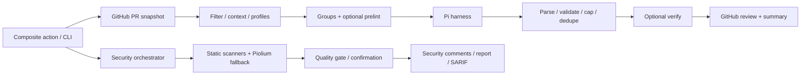

# Audit source và deep research — action-code-review

## 1. Kết luận và phạm vi

Action có nền tảng tốt để phát triển thành reviewer chuyên sâu: context từ GitHub, Pi đọc repository, chia nhóm review, skills theo stack, validation/dedupe, GitHub inline review, verify pass và security pipeline riêng. Tuy nhiên, **snapshot này chưa đủ cơ sở để gọi là reviewer xuất sắc hay vượt Copilot**. Những vấn đề lớn nằm ở ranh giới thực thi, việc biến lỗi thành kết quả sạch, bằng chứng của finding và độ trung thực của giao diện. Thêm prompt hoặc nhiều lượt agent trước khi sửa các điểm này sẽ làm hệ thống phức tạp hơn mà chưa chứng minh được chất lượng.

Audit bao quát **73 file `src/`, 9.326 dòng**, action manifests, workflow, cấu hình build, skills và tài liệu kiến trúc/contract/security; toàn bộ test suite được chạy, các test quan trọng được kiểm tra theo đường dữ liệu. Snapshot **`f59cfc34f385d89754814f7b3649b7004fe7faa4`** là HEAD và `origin/main` sau fetch ngày **12/09/2026**; commit gần nhất ngày 08/09/2026, `test(context): cover groupByArea routing (#110)`. [Inventory có SHA-256 từng file](source-inventory.json) giúp đối chiếu chính xác phạm vi. Hai bundle được build mới vào thư mục tạm; logic sản phẩm không thay đổi.

Phạm vi báo cáo là **audit + nghiên cứu + kế hoạch thực thi** trên snapshot nêu trên. Sau audit, working tree đã triển khai một phần Phase A và chạy lại regression/build; báo cáo baseline bên dưới vẫn mô tả các lỗi trước bản sửa để giữ traceability. Không có measured live API/Copilot benchmark hoặc exploit execution; kết quả không phải chứng nhận an toàn hoặc tính đầy đủ cho mọi repository.

### Trạng thái sau đợt sửa Phase A

Các đường false-clean chính đã được chặn: review/verify giữ candidate khi parse hoặc verdict không hoàn chỉnh; summary phân biệt complete với incomplete/failed; cap diễn ra sau validate/rank; category lạ được bảo toàn để policy xử lý; Pi tắt extension/skill/context discovery và chọn structured message cuối; deadline bao phủ body parse và timeout kill cả process group; suggestion code không bị HTML-escape; quality gate kiểm tra path/range; security engine/publisher giữ trạng thái lỗi và PR identity; pagination đánh dấu scope bị truncation; rule coverage không còn suy luận “passed” từ im lặng. Regression suite hiện là **48 test files / 438 tests**, typecheck/Biome/build hai bundle/smoke guard đều pass. Đây là hardening correctness, chưa phải bằng chứng quality cạnh tranh; benchmark và các P0/P1 còn lại trong roadmap vẫn bắt buộc.

“Không còn gì có thể update nữa” không phải điều kiện kết thúc khả thi: stack, API, vulnerability và đối thủ tiếp tục thay đổi. Đề xuất thay bằng một bản phát hành có phạm vi hỗ trợ rõ, tất cả quality gates đạt, không còn blocker đã biết, và có quy trình đo regression. [Roadmap](improvement-roadmap.md) cụ thể hóa điều kiện đó.

## 2. Bằng chứng kiểm tra

| Kiểm tra | Kết quả | Điều kết quả này chứng minh |
|---|---|---|
| Đồng bộ remote | Fetch thành công; HEAD = origin/main | Audit source mới nhất của main tại thời điểm kiểm tra |
| `pnpm install --frozen-lockfile` | Thành công | Dùng dependency theo lockfile; không đổi manifest/lockfile |
| `pnpm test` | **48 file test, 431 test pass** | Các assertion hiện tại pass; không chứng minh precision/recall của LLM |
| `pnpm typecheck` | Pass | Kiểm tra TypeScript hiện tại pass |
| `pnpm lint` | Pass, 121 file | Biome kiểm tra source/tests pass |
| Build ncc hai entry | Pass | Source tạo được bundle ở `/tmp/acr-audit-pr-review` và `/tmp/acr-audit-pr-content` |
| `node --check` hai bundle | Pass | Bundle có cú pháp hợp lệ trên Node 22.23.2 của môi trường audit |
| Smoke bundle, env sạch, `GITHUB_ACTIONS=true` | Hai entry khởi động và exit 1 với “This action only runs on pull requests” | Guard đầu vào chạy; **không** phải smoke review thành công với GitHub/LLM |
| So skills đóng gói với `skills/*/SKILL.md` | 9/9 khớp | Không thấy drift ở snapshot này; vẫn cần generator/check cho tương lai |
| Local witnesses | **19 witness pass: 16 hành vi cục bộ, 3 kiểm tra cấu hình tĩnh** | Tái hiện các đường lỗi cụ thể; không phải benchmark chất lượng review |

Reproduce sau khi cài dependency:

```bash
node docs/research/reproduce.mjs > docs/research/reproduction-results.json
```

[Script](reproduce.mjs) transpile source vào thư mục tạm, dùng fake harness/fetch/Octokit và token tổng hợp, dọn fixture sau khi chạy. [Kết quả máy đọc được](reproduction-results.json) ghi từng ID. Assertion cố ý mô tả **lỗi của snapshot**, không phải regression test cho bản sửa. Khi sửa source, witness tương ứng phải được thay bằng test mong đợi hành vi đúng.

Điểm đáng lưu ý: test verify hiện tại còn khẳng định malformed output được xử lý “gracefully” bằng cách bỏ finding critical. Vì vậy, 431 test xanh có thể cùng tồn tại với lỗi nghiêm trọng. Build/smoke còn phát cảnh báo deprecation `punycode`; đây là việc bảo trì dependency, không phải blocker chất lượng review.

## 3. Kiến trúc đã kiểm tra



Hai pipeline chưa có contract chung về trạng thái hoàn thành, bằng chứng, cancellation, publication và usage. Điều đó giải thích vì sao cùng một lỗi provider có thể hiện ra khác nhau: review ghi failed group nhưng summary vẫn đẹp; security bắt lỗi rồi trả risk none; audit fallback còn có nguy cơ rejection trước khi bên gọi bắt được.

| Subsystem | Đánh giá từ source | Hướng phát triển |
|---|---|---|
| `entry/`, `adapter/`, manifests | Entry tách biệt; có input contract và Pi pin. Model capabilities/cost bị hardcode; runtime isolation chưa bao quát project resources | Typed config, capabilities, trusted resource loader, artifact verification |
| `cli.ts`, `modes/` | Orchestration tập trung, nhưng nhiều mapping/wrapper và trạng thái ngầm; advertised `agent` chưa là workflow sửa code | Thin adapter + review/security/fix application services; contract matrix cho mỗi input |
| `context/` | Có pagination, filters, diff parsing, repository hints, prelint | Snapshot base/head nhất quán, coverage ledger, selective retrieval, safe analyzer execution |
| `harness/`, `llm/` | Pi có read tools; compatible endpoint dễ dùng. JSON text parsing và transport chưa xử lý đủ refusal/truncation/events | Structured contract, protocol adapter, budgets, cancellation, capability negotiation |
| `review/` | Có bounds validation, dedupe, severity caps. Verify/conflict/cap/coercion có thể làm mất hoặc diễn giải sai finding | Evidence-first validation, explicit verdicts, cap sau validate/rank, preserve raw candidates |
| `github/` | Batch review, fallback, actor filtering, buffer và summary có ích | Honest publication state, exact suggestions, GraphQL threads, head race protection, idempotency |
| `profiles/`, `skills/` | 9 skills khớp mirror; SQL detection có guard. CLI mặc định dùng tất cả profile có skill thay vì kết quả detect | Stack/version routing, rule provenance, một nguồn sinh, evaluation theo stack |
| `security/engines/`, orchestrator | Có abstraction và confirmation; deep path chưa bảo đảm native audit chạy | Engine health contract, scope riêng diff/full audit, sandbox chung, genuine profile semantics |
| Scanners/classifier/skills | Risk domain routing hữu ích; secret/dependency scans hẹp, Semgrep tùy môi trường | Pinned scanners/rules, lockfile SCA, scanner diagnostics, exact evidence semantics |
| Findings/quality gate/redaction | Có normalization/fingerprint/redaction, nhưng model tự nhận confirmed và evidence chưa được kiểm chứng | Trusted provenance, structured redaction tại mọi sink, verified evidence references |
| Reporters/SARIF | Có artifact và sticky/inline reporting | Dedupe/pagination/authorship, native fingerprints, upload workflow, partial failure visibility |
| Tests/build/workflow/docs | Suite rộng, contract tests và e2e mocks hữu ích; workflow self-review chưa chạy quality CI | Regression corpus, sandbox GitHub integration, clean build gate, benchmark/release discipline |

## 4. Findings ưu tiên sửa

**P0**: ranh giới thực thi với credential cần xử lý trước khi dùng trên PR không tin cậy. **P1**: gây bỏ sót issue quan trọng, kết quả sai hoặc phát hành thông tin không đáng tin. **P2**: reliability, tích hợp hoặc config cần hoàn thiện. Priority là khuyến nghị triển khai; không phải kết luận đã khai thác production.

### F01 — P0: Pi auto-load resources từ repository vượt ranh giới read-only

**Nguồn:** [harness/pi.ts:79](https://github.com/niko0xdev/action-code-review/blob/f59cfc34f385d89754814f7b3649b7004fe7faa4/src/harness/pi.ts#L79), [adapter/runtime.ts:14](https://github.com/niko0xdev/action-code-review/blob/f59cfc34f385d89754814f7b3649b7004fe7faa4/src/adapter/runtime.ts#L14). **Tin cậy cao; phân tích source + pinned upstream; witness `F01-static`.**

`buildPiArgs` giữ discovery extensions/skills để dùng built-in skills; chỉ tắt context files/prompt templates. Pi 0.73.1 tự nạp `.pi/extensions` và extensions có quyền thực thi OS đầy đủ.[^1] Inspection package đúng pin cho thấy project settings/packages còn được resolve trước bước lọc extensions; `.pi/SYSTEM.md`/`APPEND_SYSTEM.md` cũng có discovery riêng. `PI_CODING_AGENT_DIR` tạm chỉ cô lập config phía agent, không biến repository thành dữ liệu thụ động.[^2]

**Trigger:** PR đưa extension hoặc project resource vào workspace Pi đang chạy; process có API credential. Không cần model chọn bash tool để startup extension thực thi. Khả năng này được xác định bằng code path, chưa thử exploit. Tắt `--no-extensions` đơn lẻ chưa phải giải pháp đầy đủ vì vẫn phải kiểm soát package resolution và các resource khác.

**Sửa:** dùng explicit trusted resource loader hoặc workspace dữ liệu sạch; chỉ built-in skills đã pin; chặn project packages/extensions/system overrides; sandbox filesystem/network/process; realpath giới hạn read tool, chặn credential và `.git/config`. **Nghiệm thu:** adversarial fixtures cho từng đường discovery không chạy code/đọc bí mật; plugin tin cậy phải được bật rõ bằng policy riêng.

### F02 — P0 có điều kiện: prelint thực thi binary/config từ workspace với env của runner

**Nguồn:** [context/prelint.ts:83](https://github.com/niko0xdev/action-code-review/blob/f59cfc34f385d89754814f7b3649b7004fe7faa4/src/context/prelint.ts#L83). **Tin cậy cao về code path; witness `F02-static`, chưa thực thi binary độc hại.**

`findBinary` ưu tiên `repositoryPath/node_modules/.bin`; subprocess không có sanitized env. Nếu consumer bật prelint và workspace có binary/config/plugin do PR kiểm soát, “review read-only” trở thành thực thi code với credential. Workflow repository bật prelint nhưng không cài dependencies, nên nhiều analyzer cũng có thể chỉ skip. Rủi ro đặc biệt cao ở workflow có secret/write token xử lý code PR không tin cậy; GitHub nêu rõ ranh giới này trong hướng dẫn Actions.[^3]

**Sửa:** provision binary ở path tin cậy, config allowlist không tải plugin tùy ý, môi trường tối thiểu, read-only mount và không credential/network cho analyzer. **Nghiệm thu:** fake workspace binary bị từ chối; missing analyzer hiển thị skipped; required analyzer failed làm review incomplete. Không tự chạy install scripts của PR để “bật đủ tools”.

### F03 — P1: verify JSON lỗi xóa high/critical và hạ risk về none

**Nguồn:** [review/verify.ts:299](https://github.com/niko0xdev/action-code-review/blob/f59cfc34f385d89754814f7b3649b7004fe7faa4/src/review/verify.ts#L299). **Tin cậy cao; witness `F03`.**

JSON không parse được trả `{ verified: [] }`; caller coi đó là verdict hợp lệ và bỏ mọi high/critical. Fixture một critical + output không phải JSON cho kết quả remaining 0, dropped 1, risk none. Exception được catch khác với malformed response, nên không thể nói “verify đã fail-safe”. Prompt verify chỉ đưa claim và một danh sách filename, không có patch/source đủ để kiểm chứng; cùng model không tự tạo sự độc lập về bằng chứng.

**Sửa:** phân biệt `valid verdict`, `refused`, `incomplete`, `parse_error`, `timeout`; lỗi giữ candidate và ghi trạng thái chưa xác minh. Stable ID cho mỗi finding; chỉ drop khi có explicit refutation với evidence base/head. **Nghiệm thu:** lỗi schema/refusal/partial verdict không làm biến mất critical; verify biết file ngoài first 20; giữ ledger kept/refuted/uncertain/error. Structured Outputs giúp schema, không chứng minh finding đúng.[^4]

### F04 — P1: summary tuyên bố APPROVED khi review không hoàn thành

**Nguồn:** [github/comments.ts:96](https://github.com/niko0xdev/action-code-review/blob/f59cfc34f385d89754814f7b3649b7004fe7faa4/src/github/comments.ts#L96), [github/review.ts:318](https://github.com/niko0xdev/action-code-review/blob/f59cfc34f385d89754814f7b3649b7004fe7faa4/src/github/review.ts#L318). **Tin cậy cao; witness `F04`.**

Publisher đã có failed-group guard để không thực sự APPROVE; đây là điểm đúng. Nhưng renderer vẫn in APPROVED và “All clear… Approving” khi findings rỗng, không hiện failedGroups. Nó còn trình bày category/rule pass khi chưa có proof execution. Người dùng nhìn banner sẽ hiểu sai kết quả thật, kể cả GitHub review chỉ COMMENT vì permission hoặc policy.

**Sửa:** tách assessment, completeness và publication. `complete_clean`, `complete_issues`, `incomplete`, `failed`, `stale`, `skipped` có ngữ nghĩa riêng; render event thực tế sau publish. **Nghiệm thu:** group lỗi, context thiếu, write denied, stale head không bao giờ hiển thị approved/fully checked. Coverage phải giải thích no patch, excluded, budget-limited, failed riêng.

### F05 — P1: HTML escape làm sai code trong suggestion

**Nguồn:** [github/comments.ts:45](https://github.com/niko0xdev/action-code-review/blob/f59cfc34f385d89754814f7b3649b7004fe7faa4/src/github/comments.ts#L45), [github/suggestions.ts](https://github.com/niko0xdev/action-code-review/blob/f59cfc34f385d89754814f7b3649b7004fe7faa4/src/github/suggestions.ts). **Tin cậy cao; witness `F05`.**

`mdSafe` áp dụng lên `replacement`, rồi đưa vào fenced suggestion. `<`, `>`, `&`, quote thành HTML entities nhưng code fence giữ literal: áp dụng suggestion sẽ đổi code. Ngoài ra replacement tối đa 10 dòng chưa đi kèm contract range/hash; publisher anchor một dòng không bảo đảm intended replacement nhiều dòng đúng.

**Sửa:** escape prose riêng; giữ exact code bytes; chống đóng fence; original range + head blob hash + expected text; chỉ publish code patch nếu apply kiểm chứng được. **Nghiệm thu:** roundtrip JSX, generics, quotes, operators, Unicode và multiline suggestion giữ nguyên byte; không xác minh được thì degrade thành prose.

### F06 — P1: thiếu redaction ở các publication sinks và raw agent debug

**Nguồn:** [github/comments.ts:10](https://github.com/niko0xdev/action-code-review/blob/f59cfc34f385d89754814f7b3649b7004fe7faa4/src/github/comments.ts#L10), [harness/pi.ts:178](https://github.com/niko0xdev/action-code-review/blob/f59cfc34f385d89754814f7b3649b7004fe7faa4/src/harness/pi.ts#L178), [security/redaction/redactor.ts](https://github.com/niko0xdev/action-code-review/blob/f59cfc34f385d89754814f7b3649b7004fe7faa4/src/security/redaction/redactor.ts). **Tin cậy cao; witness `F06` dùng token tổng hợp.**

Finding body chỉ escape Markdown/HTML; debug section đưa stdout/stderr vào step summary. Fixture token xuất hiện nguyên văn ở cả hai. Input scrubbing là hữu ích nhưng không bao phủ source agent đọc bằng tools hoặc output model/tool/log. Security redaction trên raw JSON trước parse còn có thể làm hỏng structured content; regex bounded có rủi ro để lại suffix của credential dài. Đừng coi raw event log là nội dung mặc định phù hợp để đăng lên summary.

**Sửa:** central structured redaction trước mọi sink: comment, review body, output, summary, SARIF, artifact, exception/log; exact registered-secret replacement kết hợp detectors; logs mặc định chỉ metadata/evidence đã lọc, raw trace quyền truy cập/retention riêng. **Nghiệm thu:** canary secrets qua tất cả nguồn/sinks, token dài, private key multiline, encoded variants và malformed output; không lộ secret, không phá JSON.

### F07 — P1: custom review prompt không đi vào Pi

**Nguồn:** [cli.ts:694](https://github.com/niko0xdev/action-code-review/blob/f59cfc34f385d89754814f7b3649b7004fe7faa4/src/cli.ts#L694), [review/reviewer.ts:26](https://github.com/niko0xdev/action-code-review/blob/f59cfc34f385d89754814f7b3649b7004fe7faa4/src/review/reviewer.ts#L26), [harness/pi.ts:228](https://github.com/niko0xdev/action-code-review/blob/f59cfc34f385d89754814f7b3649b7004fe7faa4/src/harness/pi.ts#L228). **Tin cậy cao; witness `F07` capture stdin fake Pi.**

CLI truyền `promptFile`/`reviewPrompt` vào `runReview.options.extraRules`; `runReview` không dùng option đó. Pi chỉ dùng extraRules của constructor, đã tạo trước từ profiles/security. User tưởng rule tùy chỉnh đang áp dụng nhưng thực tế không. Prompt-file containment hiện kiểm tra lexical path rồi stat/read theo symlink; cần realpath khi nối lại wiring.

**Sửa:** một typed prompt assembly service, nguồn policy có trust/provenance rõ; pass rules qua harness request thay vì constructor ngầm. **Nghiệm thu:** test từ action input đến final request; tùy chỉnh hiện trong prompt manifest; symlink outside root bị từ chối, rule chưa được đọc không được đánh dấu applied.

### F08 — P1: security deep không bảo đảm deep audit; failure không được biểu đạt

**Nguồn:** [security/engines/piolium-engine.ts:24](https://github.com/niko0xdev/action-code-review/blob/f59cfc34f385d89754814f7b3649b7004fe7faa4/src/security/engines/piolium-engine.ts#L24), [security/engines/pi-security-engine.ts:210](https://github.com/niko0xdev/action-code-review/blob/f59cfc34f385d89754814f7b3649b7004fe7faa4/src/security/engines/pi-security-engine.ts#L210), [security/orchestrator.ts:50](https://github.com/niko0xdev/action-code-review/blob/f59cfc34f385d89754814f7b3649b7004fe7faa4/src/security/orchestrator.ts#L50). **Tin cậy cao; witness `F08` cho diff + inspection audit.**

Adapter import optional `@vigolium/piolium` rồi chờ hàm `runAudit`; dependency đó không có trong manifest. Package 0.0.13 kiểm tra tại ngày audit ship CLI/extensions, không có exported entry `runAudit` như contract giả định.[^5] Nếu không có custom compatible module, lite/balanced/deep fallback đều thành `PiSecurityEngine.diff`. Khi có API key, engine này gọi chat completion trên diff, không phải Pi khám phá repository. `confirm` profile được map thành balanced; manual/scheduled audit không có changed files thì không tự tạo full-repo scope.

Diff provider outage được catch rồi kết luận findings 0/risk none, không engine failure field. Riêng audit fallback `return fallbackEngine.diff(ctx)` đi qua `finally await rm(...)` mà không await promise: lần reproduce đầu trên Node 22 đã exit với unhandled rejection trước khi catch ở orchestrator xử lý. Witness ổn định chuyển sang diff để đo riêng hành vi fail-open, không gộp hai kết quả thành một claim.

Fallback CLI không key còn thiếu tool/resource/env restrictions, timeout/output cap và event extraction của harness chính.

**Sửa:** kiểm chứng native API/CLI đúng pin hoặc implement native audit qua Pi SDK; profile có observable scope/budget/phases; dùng chung sandbox/protocol/transport; `return await` trước async cleanup; engine health bắt buộc trong conclusion. **Nghiệm thu:** deep fixture có issue ở file không nằm trong diff; API outage trả incomplete; missing adapter không silently downgrade; CLI fallback có cùng security guarantees; confirm chỉ xác minh input candidates.

### F09 — P1: security “validated” không bảo đảm file/line/evidence hợp lệ

**Nguồn:** [security/validators/quality-gate.ts:39](https://github.com/niko0xdev/action-code-review/blob/f59cfc34f385d89754814f7b3649b7004fe7faa4/src/security/validators/quality-gate.ts#L39), [security/findings/normalizer.ts](https://github.com/niko0xdev/action-code-review/blob/f59cfc34f385d89754814f7b3649b7004fe7faa4/src/security/findings/normalizer.ts). **Tin cậy cao; witness `F09`.**

Gate chủ yếu kiểm tra filename membership nếu allowedFiles không rỗng, confidence, có evidence item và severity. Fixture `startLine=999999`, `endLine=2`, evidence chỉ là reasoning vẫn được validated. Không có file cũng có thể qua gate; empty scope không hạn chế path. Model có thể tự nhận `confirmed` và định danh/fingerprint mà downstream tin dùng.

**Sửa:** schema + path canonicalization + blob/range/hunk checks; host sinh IDs/provenance; phân biệt reported confidence, calibrated confidence và independently confirmed evidence. Diff inline scope khác audit report scope. **Nghiệm thu:** impossible range/path/nonexistent/forged confirmed bị từ chối; evidence excerpt khớp pinned blob; summary-only finding có lý do rõ, không bị giả định inline-valid.

### F10 — P1: heuristic conflict bỏ hai bug độc lập

**Nguồn:** [review/validator.ts](https://github.com/niko0xdev/action-code-review/blob/f59cfc34f385d89754814f7b3649b7004fe7faa4/src/review/validator.ts). **Tin cậy cao; witness `F10`.**

Hai finding gần nhau, cùng category, một có add/missing/should và một có remove/delete bị suy thành mâu thuẫn. Fixture “add tenant filter” và “remove hardcoded admin bypass” là hai vấn đề cần sửa đồng thời nhưng chỉ còn một. Keyword polarity không xác định cùng invariant hoặc cùng proposed change.

**Sửa:** dedupe bằng defect identity/evidence/invariant; nếu thật sự conflict, giữ candidate ở trạng thái unresolved và xác minh, không xóa bởi lexical confidence ranking. **Nghiệm thu:** cặp independent add/remove cùng file được giữ; duplicate paraphrase merge không mất evidence; contradiction thực sự có reason + ledger.

### F11 — P1: nối mọi assistant message_end làm hỏng final JSON

**Nguồn:** [harness/pi.ts:140](https://github.com/niko0xdev/action-code-review/blob/f59cfc34f385d89754814f7b3649b7004fe7faa4/src/harness/pi.ts#L140). **Tin cậy cao; witness `F11`.**

`extractAssistantText` concatenate text từ mọi assistant message_end. Nếu một lượt khám phá và lượt cuối đều có JSON, extraction first `{` đến last `}` không parse được. Agent nhiều lượt cần protocol adapter có terminal artifact; không phải gom tất cả lời assistant. Stop reason/error cũng cần được biểu đạt.

**Sửa/nghiệm thu:** select final successful structured result hoặc output tool chuyên dụng; fixture reasoning/tool turns/intermediate JSON/final JSON/error-after-text/truncation đều có trạng thái đúng, không biến thành clean.

### F12 — P1: findings sai schema được coi là danh sách rỗng

**Nguồn:** [harness/harness.ts:99](https://github.com/niko0xdev/action-code-review/blob/f59cfc34f385d89754814f7b3649b7004fe7faa4/src/harness/harness.ts#L99). **Tin cậy cao; witness `F12`.**

`{"summary":"ok","findings":"invalid"}` được chấp nhận findings empty. Partial invalid entries bị coerce/drop mà chưa có đầy đủ malformed diagnostics. Đây là false-clean boundary, không chỉ parser tiện dụng.

**Sửa/nghiệm thu:** strict versioned schema, bounded repair một lần nếu provider cho phép; repair thất bại => incomplete; thống kê invalid entries; không dùng default array empty thay cho invalid response.

### F13 — P1: rule coverage “passed” là suy diễn, không phải đo

**Nguồn:** [review/reviewer.ts:144](https://github.com/niko0xdev/action-code-review/blob/f59cfc34f385d89754814f7b3649b7004fe7faa4/src/review/reviewer.ts#L144). **Tin cậy cao; witness `F13`.**

Total là số bullet trong rules; passed = total - số unique finding rule IDs. Fake harness trả empty thì 4/4 rules “passed” dù không có bằng chứng đã kiểm tra chúng. Category tables còn tái sử dụng ratio này. Không có finding không đồng nghĩa kiểm tra rule thành công.

**Sửa/nghiệm thu:** execution ledger `assessed_with_evidence`, `issue_found`, `not_assessed`, `unsupported`, `error`; tách deterministic checks khỏi LLM areas explored; không render passed/coverage số học nếu không có measurement.

### F14 — P2: security comment dedupe thiếu pull_number

**Nguồn:** [security/reporters/security-publisher.ts:180](https://github.com/niko0xdev/action-code-review/blob/f59cfc34f385d89754814f7b3649b7004fe7faa4/src/security/reporters/security-publisher.ts#L180), [cli.ts:156](https://github.com/niko0xdev/action-code-review/blob/f59cfc34f385d89754814f7b3649b7004fe7faa4/src/cli.ts#L156). **Tin cậy cao; witness `F14`.**

Publisher gọi listCommentsForReview không có `pull_number`, trong khi CLI wrapper bắt buộc field này. Exception bị swallow, existing IDs thành empty, finding đã đăng lại publish. Real endpoint cũng cần PR number.[^6] Security pagination chỉ first 50 reviews/100 comments mỗi review; sticky chỉ first page; authorship của marker chưa được kiểm soát như pipeline chính.

**Sửa/nghiệm thu:** typed endpoint request, paginate, actor-owned markers và stable IDs; rerun cùng SHA không tạo comment mới; human spoof marker không suppress finding hoặc bị update.

### F15 — P2: PR file pagination dừng 1.000 mà không báo thiếu

**Nguồn:** [context/pr.ts:60](https://github.com/niko0xdev/action-code-review/blob/f59cfc34f385d89754814f7b3649b7004fe7faa4/src/context/pr.ts#L60). **Tin cậy cao; witness `F15`.**

Default 10 pages × 100 files; không có truncated flag. GitHub endpoint hỗ trợ tối đa 3.000 files, vẫn có giới hạn riêng.[^7] Fixture luôn đầy page chỉ nhận 1.000 rồi kết thúc mà context không báo thiếu. Đây độc lập với max-files review filter: collection phải biết corpus đầy đủ trước khi áp policy.

**Sửa/nghiệm thu:** đối chiếu `changed_files`, pagination/Link và local base/head diff; nếu không lấy đủ thì incomplete, ghi numerator/denominator; fixtures 1.001 và >3.000, rename/delete/binary/patch omitted không bị gọi chung “excluded by filter”.

### F16 — P2: provider timeout chỉ bảo vệ thời gian tới response headers

**Nguồn:** [llm/openai-compatible.ts:55](https://github.com/niko0xdev/action-code-review/blob/f59cfc34f385d89754814f7b3649b7004fe7faa4/src/llm/openai-compatible.ts#L55). **Tin cậy cao; witness `F16`.**

Timer bị clear trong finally quanh fetch, trước `response.json()`/error body. Fixture timeout 5ms, body delay 40ms vẫn trả ok, signal không aborted. Response body không có size cap; direct calls chưa có classified retry/backoff/Retry-After toàn diện.

**Sửa/nghiệm thu:** deadline bao gồm body parse/stream, abort socket và cap bytes; retry chỉ lỗi transient, bounded jitter + total budget; không retry bad schema/auth không cần thiết. Test delayed body, 429/503, 401, oversized/invalid JSON, cancellation.

### F17 — P1: slice trước rank/validation làm mất critical ở cuối response

**Nguồn:** [review/reviewer.ts:69](https://github.com/niko0xdev/action-code-review/blob/f59cfc34f385d89754814f7b3649b7004fe7faa4/src/review/reviewer.ts#L69). **Tin cậy cao; witness `F17`.**

`findings.slice(0, overallLimit)` chạy trước cap theo severity và validation. Fixture 20 low + 1 critical mất critical. Invalid entries trong prefix còn có thể chiếm chỗ của valid findings về sau. Presentation cap không được làm thay đổi bản chất risk hoặc xóa phát hiện trong artifact.

**Sửa/nghiệm thu:** parse bounded maximum an toàn, validate tất cả candidates trong limit contract, rank/dedupe rồi cap publication; retained full findings/hidden count/risk dựa trên assessed findings. Permute thứ tự output không đổi critical recall hoặc conclusion.

### F18 — P2: unknown category được map correctness trước bucket-low policy

**Nguồn:** [harness/harness.ts:131](https://github.com/niko0xdev/action-code-review/blob/f59cfc34f385d89754814f7b3649b7004fe7faa4/src/harness/harness.ts#L131), [review/reviewer.ts:99](https://github.com/niko0xdev/action-code-review/blob/f59cfc34f385d89754814f7b3649b7004fe7faa4/src/review/reviewer.ts#L99). **Tin cậy cao; witness `F18`.**

Parser đổi unknown category thành correctness và giữ critical; downstream normalize không nhìn thấy unknown để áp documented bucket-low. Rule/provenance bị diễn giải sai, docs/tests riêng lẻ không bắt được composition.

**Sửa/nghiệm thu:** preserve original enum + validation diagnostic hoặc reject schema; một nơi quyết định compatibility policy; test xuyên parser→reviewer→publisher cho unknown/legacy categories. Không dùng unknown category để tự ý hạ severity của vulnerability đã có proof.

### F19 — P1: Pi timeout hủy SIGKILL escalation ngay sau khi đặt

**Nguồn:** [harness/pi.ts:275](https://github.com/niko0xdev/action-code-review/blob/f59cfc34f385d89754814f7b3649b7004fe7faa4/src/harness/pi.ts#L275), [harness/pi.ts:35](https://github.com/niko0xdev/action-code-review/blob/f59cfc34f385d89754814f7b3649b7004fe7faa4/src/harness/pi.ts#L35). **Tin cậy cao từ source; witness `F19-static` chỉ kiểm tra args, không chứng minh process termination.**

Timeout gửi SIGTERM, đặt killTimer 250ms, rồi `finish(error)` ngay; finish clear killTimer. Process bỏ qua SIGTERM có thể tiếp tục, detached descendants cũng không bị quản lý bằng child.kill parent. Controller báo đã dừng nhưng compute/network chưa chắc dừng.

Argument allowlist còn chấp nhận `--max-duration` mà parser upstream đúng pin không hỗ trợ; `--model-override` và model config cần typed semantics. Vì dùng spawn args không shell, đây **không phải bằng chứng shell injection**.

**Sửa/nghiệm thu:** terminate process group/session với grace + escalation, reap/close trước cleanup; timeout toàn review; parser atomic chỉ options đúng pinned protocol. Harmless fixture ignore SIGTERM + child descendant chứng minh không còn process sau deadline; Windows có cơ chế tương đương.

### F20 — P1: unresolved-thread lookup dùng REST route không có trong contract GitHub

**Nguồn:** [cli.ts:173](https://github.com/niko0xdev/action-code-review/blob/f59cfc34f385d89754814f7b3649b7004fe7faa4/src/cli.ts#L173), [github/review.ts](https://github.com/niko0xdev/action-code-review/blob/f59cfc34f385d89754814f7b3649b7004fe7faa4/src/github/review.ts). **Tin cậy cao từ integration contract; chưa gọi GitHub thật.**

Wrapper paginate `GET /repos/{owner}/{repo}/pulls/{pull_number}/threads`. Thread resolution là dữ liệu GraphQL `reviewThreads`/`PullRequestReviewThread.isResolved`, không phải REST route này trong pulls review API.[^6][^8] Auto-approve-when-resolved vì vậy chưa có integration đúng như advertised; fake tests không phát hiện endpoint sai.

**Sửa/nghiệm thu:** GraphQL pagination + author/ID/head association; lookup failure => unknown, không kết luận all resolved. Resolving thread là tín hiệu workflow, không phải proof bug đã sửa. Test integration sandbox với unresolved/resolved/outdated/human thread, rerun/new head và permission failure.

## 5. Các khoảng trống khác cần đưa vào backlog

| Khoảng trống | Hệ quả | Đề xuất |
|---|---|---|
| Default gpt-4, max-files 10, critical-only, exclude JSON/YAML | Trải nghiệm mặc định bỏ nhiều high/medium và workflow/dependency/config | Giữ v1 contract; thêm preset/version mới, docs migration; config/security không bị bỏ mặc định trong preset mới |
| Profile detection xong nhưng CLI mặc định dùng all nine built-ins | Prompt quá rộng; SQL profiles không được nạp ở default này | Detect stack + actual dependency versions; chọn rule theo changed symbols/risk, ghi reason |
| Context giới hạn bằng chars sau join | Có thể cắt hunk giữa chừng; rules/title/body/tool evidence ngoài budget | Token-aware global allocator, complete fragments, retrieval budget và coverage ledger |
| Include-full-content là hướng dẫn tool, không proof đã inspect | Files-reviewed dựa trên group success có thể quá lạc quan | Log inspected blobs/ranges và task scope; không hứa full context theo boolean |
| Model config fixed chat API, reasoning false, 128k/16k, cost zero | Không phản ánh model/gateway thật; budget/telemetry không đáng tin | Provider capabilities + model snapshot registry; actual usage/cost; unknown cost phải là unknown |
| Verify USD estimate dùng fixed price, không actual toàn pipeline | Ceiling không bảo đảm total spend | Budget reserve, usage ledger và model-aware estimation; include cached/reasoning/tool/retry overhead |
| `mode: auto/agent`, riskThreshold, security Pi args/progress không có semantics đầy đủ | Inputs được nhận nhưng user expectation chưa được đáp ứng | Input-to-behavior contract tests; unsupported/degraded explicit, implement từng mode |
| Semgrep chạy không explicit config; errors/skip có thể bị đọc như clean | Phụ thuộc env, rule coverage không reproducible | Pin binary/rules/checksum, `--config` rõ; record config digest, execution errors.[^9] |
| CodeQL là status hook, dependency scan chủ yếu regex package.json | Chưa phải full CodeQL ingestion/SCA vulnerability analysis | SARIF ingestion + license/resource docs; lockfile-resolved OSV advisory queries.[^10] |
| Wildcard deps gắn confirmed mặc dù exploitability theoretical | Confuses exact pattern detection với vulnerability proven | Verified detector match riêng; security severity cần threat model + lockfile/call path |
| SARIF fingerprint chỉ trong properties | Dedupe/interop code scanning hạn chế | Standard native fingerprints, schema validation, workflow upload tùy permission |
| PR content update thiếu optimistic conflict bảo vệ human edits | Có thể overwrite description/title thay đổi trong lúc generate | Managed section/preview; re-fetch compare before update; preserve human checklist; bounded retry/incomplete guard |
| GitHub publish không final head recheck nhất quán | Review/approval trên snapshot cũ khi PR đổi trong lúc chạy | Pin checkout/API head, re-fetch trước publish, stale result artifact; rerun controlled |
| Workflow hiện chỉ AI self-review | Repo tests/lint/build chưa thành required quality CI | CI riêng không secret cho code PR; unit/integration/contract/build-dist gate; trusted reviewer workflow riêng |
| Global npm Pi + regex version guard + unquoted action path | Trusted provisioning/portability chưa chặt | Controlled toolcache, exact version/integrity verification; quote path; offline/pinned release docs |
| Skills mirror hiện đúng nhưng build không sinh/check mirror | Dễ drift sau edit | One authoritative source + generator + CI byte check; stack rule revisions và eval cases cùng PR |

## 6. Deep research: baseline đối thủ và kỹ thuật

### Copilot tại thời điểm nghiên cứu

Copilot code review hiện đã dùng full-project context, hỗ trợ auto review khi có push và handoff finding sang cloud agent tạo PR; GitHub mô tả model mix phục vụ review, không cho user tùy ý đổi model.[^11] Reviewer còn dùng repository skills và MCP; cấu hình MCP có tool read-only annotation gate.[^12][^13] Cloud agent có môi trường Actions để sửa feature/bug, chạy tests/linters và tạo PR.[^14] Review mặc định là COMMENT; approval preview có cấu hình riêng, cần so đúng chế độ.[^15]

Vì vậy, “có agent, context toàn repo, skills, MCP, autofix” **chưa phải lợi thế khác biệt**. Lợi thế đáng đầu tư của action này là bằng chứng có thể kiểm tra lại, confidence được đo, self-host/custom endpoint, cost control minh bạch và workflow theo policy. Đây là giả thuyết sản phẩm của audit, chưa phải kết quả benchmark.

| Năng lực | Snapshot action | Baseline Copilot / yêu cầu cạnh tranh |
|---|---|---|
| PR inline review | Có, nhưng F04/F05/F14 ảnh hưởng trust | Integration đúng, comment ít noise và evidence đủ |
| Repository context | Pi read tools; scope/coverage thiếu rõ ràng | Full context đã có; action cần selective evidence retrieval tốt hơn[^11] |
| Rules/skills | 9 stack skills; custom wiring lỗi | Skills đã có; cần rule versioning/provenance/eval[^13] |
| External context | Chưa có controlled MCP review path | MCP đã có; thêm allowlist + egress policy + source citations[^12] |
| Fix workflow | `agent` chưa là safe fix pipeline | Cloud agent có tests/linters/PR; action cần prove bug + verify patch[^14] |
| Review lifecycle | Buffer/dedupe/autoapprove intent; integration gaps | Cần đánh giá nhiều vòng, state theo SHA, resolved bằng code proof |
| Provider portability | Compatible endpoint là điểm tốt, hardcode capabilities | Chọn model/gateway có khả năng trở thành khác biệt nếu benchmark đạt |
| Security/privacy | Prompt notice/redaction có; sandbox/publication gaps | Không thể bán safety claim trước khi F01/F02/F06 được xử lý |

### Bằng chứng nghiên cứu và giới hạn

**SWE-PRBench**, preprint 27/03/2026, corpus 350 PR nhưng v1 leaderboard đánh giá sample 100; chủ yếu Python. Báo cáo phát hiện 15–31% human-flagged issues ở diff-only, context configurations rộng hơn giảm kết quả trong setup đó. Bài dùng LLM judges và không có measured human baseline; taxonomy/phân bố ở các phần còn khác nhau. Không suy rộng rằng mọi retrieval đều có hại hoặc đây là ranking Copilot hiện tại. Bài gợi ý cần ablation context trên corpus của action.[^16]

**CR-Bench**, preprint 10/03/2026, tách bug hits, valid suggestions và noise; xét usefulness/SNR ngoài recall. Thử single-shot và Reflexion cho thấy tìm nhiều hơn có thể tăng noise trong setup nghiên cứu. Đây là lý do đo cả đúng/sai/actionability, không tối ưu số finding hay số lượt agent. Paper chưa chứng minh mọi reflection agent đều kém.[^17]

**MCR-Bench**, bản 27/08/2026, có 2.269 task nhiều vòng ở năm ngôn ngữ, theo dõi defect state qua review rounds. Annotation dùng pipeline LLM và manual validation; consistency filtering và thiếu repo enterprise là hạn chế. Những lỗi state/memory trong nghiên cứu làm rõ nhu cầu benchmark new/open/resolved/regressed, không chỉ tìm bug ở một diff.[^18]

Đây là nguồn nghiên cứu sơ cấp, không phải chứng nhận độc lập rằng action hoặc Copilot tốt hơn. Dataset public hữu ích làm supplemental evaluation; quyết định release cần private holdout sát repository mục tiêu và human adjudication.

### OpenAI API + Pi: lựa chọn thiết kế

Pi đúng pin hỗ trợ nhiều provider API, gồm `openai-responses`; không cần bỏ Pi chỉ để dùng API native.[^19] Đề xuất giữ Pi làm agent/tool loop dưới một sandbox và protocol adapter do action kiểm soát. Tách structured final output khỏi intermediate events; giữ compatible chat backend cho gateway không hỗ trợ Responses. Native tools/custom functions/MCP cần allowlist và enforcement ngoài prompt.[^20]

Provider metadata phải phản ánh capabilities thực: endpoint/API family, strict schema, token limit, reasoning options, cancellation, usage và giá. Không cố định temperature/reasoning knobs cho mọi model. Chọn model snapshot qua evaluation thay vì gọi một tên “mới nhất” là tốt nhất. OpenAI khuyến nghị continuous evaluation khi thay đổi hệ thống và mở rộng dataset theo lỗi quan sát.[^21]

Prompt cache là tối ưu cần đo theo model/gateway: exact stable prefix, cache-hit tokens, latency và cost thực; không mặc định mọi compatible endpoint có semantics giống OpenAI.[^22] Privacy preset phải nói rõ endpoint/retention: `store:false` không tự đồng nghĩa Zero Data Retention; abuse-monitoring retention và application state khác nhau, MCP bên thứ ba có policy riêng.[^23]

## 7. Thứ tự quyết định

1. **Sửa trust boundaries và false-clean trước:** F01/F02/F03/F04/F06/F08/F12/F19. Chưa mở rộng quyền sửa code ở giai đoạn này.
2. **Khôi phục feature correctness:** prompt wiring, exact suggestions, severity cap, conflict logic, quality gate, GitHub threads/dedupe; thêm regression tests xuyên composition.
3. **Xây evaluation trước prompt/agent expansion:** snapshot baseline hiện tại; clean/adversarial/cross-file/multiround corpus; đo costs/latency và confidence.
4. **Cải thiện context/evidence:** selective retrieval, source citations, base/head behavior contracts, deterministic analyzers và coverage ledger.
5. **Sau quality gates mới thêm safe fix + enterprise:** sandbox repro/patch verification, human-controlled publishing policy, data controls và observability.

Roadmap không cần một rewrite toàn bộ ngay lập tức. Giữ public v1 contract và adapters; thay dần internals bằng typed services có tests. Contract cho phép additive fields; “frozen v1” không cấm phát triển feature mới, nhưng không được đổi tên/default/ngữ nghĩa cũ mà không migration.

## 8. Nguồn và cách sử dụng

Nguồn upstream được đối chiếu ngày 12/09/2026. Official docs hỗ trợ product/API contracts; research papers là bằng chứng có giới hạn. Source findings dựa trên snapshot cố định. [Source inventory](source-inventory.json), [witness results](reproduction-results.json) và [source register](source-register.json) cung cấp audit evidence và danh mục publisher/title/date/URL. Footnotes dưới đây ghi đầy đủ nguồn. Không dùng marketing leaderboard làm bằng chứng vượt đối thủ.

[^1]: [Pi 0.73.1 — Extensions](https://raw.githubusercontent.com/badlogic/pi-mono/v0.73.1/packages/coding-agent/docs/extensions.md). Discovery và quyền thực thi extension; bằng chứng upstream cho F01.
[^2]: [Pi package metadata đúng pin 0.73.1](https://registry.npmjs.org/@mariozechner/pi-coding-agent/0.73.1); [resource loader source đúng tag](https://github.com/badlogic/pi-mono/blob/v0.73.1/packages/coding-agent/src/core/resource-loader.ts). Package được download/extract để inspection, không install/run. Project resource resolution cần isolation riêng.
[^3]: [GitHub Actions — Secure use](https://docs.github.com/en/actions/reference/security/secure-use). Credential/trust boundary khi xử lý code không tin cậy.
[^4]: [OpenAI — Structured Outputs](https://developers.openai.com/api/docs/guides/structured-outputs). Strict schema, refusal/incomplete handling; không phải factual verification.
[^5]: [Piolium upstream](https://github.com/vigolium/piolium); [package metadata 0.0.13](https://registry.npmjs.org/@vigolium/piolium/0.0.13). CLI/extensions package inspection; không giả định custom/private historical adapter có cùng contract.
[^6]: [GitHub REST — Pull request reviews](https://docs.github.com/en/rest/pulls/reviews). Review/comment endpoint contracts.
[^7]: [GitHub REST — List pull request files](https://docs.github.com/en/rest/pulls/pulls#list-pull-requests-files). Pagination và giới hạn 3.000 files.
[^8]: [GitHub GraphQL — Pull requests reference](https://docs.github.com/en/graphql/reference/pulls). `reviewThreads`, `PullRequestReviewThread`, resolution state.
[^9]: [Semgrep — Running rules](https://docs.semgrep.dev/running-rules). Explicit rule configuration và execution reproducibility.
[^10]: [OSV API](https://google.github.io/osv.dev/api/). Advisory queries/batch queries; đề xuất SCA, chưa triển khai.
[^11]: [GitHub — About Copilot code review](https://docs.github.com/en/copilot/concepts/agents/code-review). Baseline full-project context, automation, model mix, handoff. Trạng thái product có thể thay đổi sau audit.
[^12]: [GitHub — Configure MCP servers](https://docs.github.com/en/copilot/how-tos/copilot-on-github/customize-copilot/configure-mcp-servers). Repository MCP settings, default servers và read-only annotation gate.
[^13]: [GitHub — Adding agent skills](https://docs.github.com/en/copilot/how-tos/copilot-on-github/customize-copilot/customize-cloud-agent/add-skills). Skills áp dụng cho code review và cloud agent.
[^14]: [GitHub — About Copilot cloud agent](https://docs.github.com/en/copilot/concepts/agents/cloud-agent/about-cloud-agent). Coding workflow, ephemeral environment, tests/linters/PR.
[^15]: [GitHub — Using Copilot code review](https://docs.github.com/en/copilot/how-tos/use-copilot-agents/request-a-code-review/use-code-review). Review event mặc định và approval configuration/preview.
[^16]: [Kumar — SWE-PRBench v1, 27/03/2026](https://arxiv.org/html/2603.26130v1). Đọc cả limitations/sample/context methods, không chỉ abstract.
[^17]: [Pereira et al. — CR-Bench v1, 10/03/2026](https://arxiv.org/html/2603.11078v1). Utility/noise metrics và comparative agent experiments.
[^18]: [Zheng et al. — MCR-Bench v1, 27/08/2026](https://arxiv.org/html/2608.27442v1). Multiround defect lifecycle và threats to validity.
[^19]: [Pi 0.73.1 — Custom models](https://raw.githubusercontent.com/badlogic/pi-mono/v0.73.1/packages/coding-agent/docs/models.md). Provider API families và compatibility metadata.
[^20]: [OpenAI — Tools](https://developers.openai.com/api/docs/guides/tools). Native/custom tools/MCP; enforcement đề xuất là kết luận thiết kế của audit.
[^21]: [OpenAI — Evaluation best practices](https://developers.openai.com/api/docs/guides/evaluation-best-practices). Continuous evaluation và dataset evolution.
[^22]: [OpenAI — Prompt caching](https://developers.openai.com/api/docs/guides/prompt-caching). Prefix/caching controls phụ thuộc model; cần đo actual usage.
[^23]: [OpenAI — Data controls](https://developers.openai.com/api/docs/guides/your-data). Abuse monitoring, application state, ZDR eligibility và third-party data policies.
