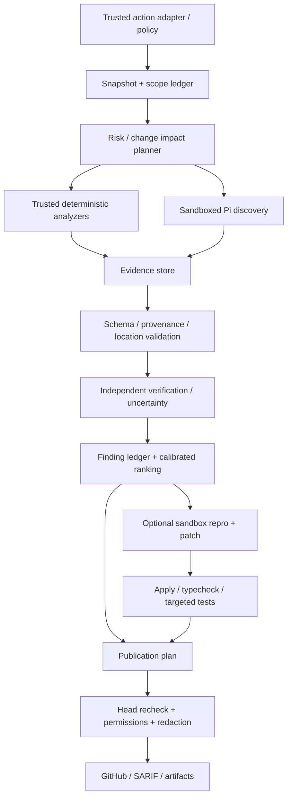

# Roadmap reviewer xuất sắc và agent phát triển tiếp

## 1. Mục tiêu sản phẩm có thể kiểm chứng

Kế hoạch bắt đầu từ baseline **`f59cfc34f385d89754814f7b3649b7004fe7faa4`, 12/09/2026**. Working tree hiện đã triển khai một phần Phase A; các feature/gates còn lại **chưa được triển khai hoặc đạt**. [Audit và nguồn nghiên cứu](code-review-deep-research.md), [local witnesses](reproduction-results.json) là cơ sở trước khi quyết định release.

## Cập nhật implementation hiện tại

Đợt triển khai này đã xử lý các đường false-clean và mất bằng chứng có tác động lớn: review giữ toàn bộ candidate trước khi cap, trạng thái incomplete/failed được truyền tới summary và không phát hành approval, malformed verify/schema không làm rơi finding, unknown category không bị đổi thành correctness, conflict resolver không xoá finding độc lập, Pi chọn message JSON cuối có cấu trúc, timeout bao phủ cả response body và kill process group, Pi tắt discovery không tin cậy, custom rules được forward, suggestion giữ nguyên byte code, sink comment/debug redaction được áp dụng, quality gate kiểm tra path/range, security conclusion và sticky summary báo engine failure, security dedupe truyền pull number, pagination báo `filesTruncated`, và prelint từ chối candidate binary không phải executable hoặc symlink thoát khỏi checkout.

Các thay đổi này có regression tests, `pnpm typecheck`, Biome, `pnpm test` (**48 file / 438 test pass**), `pnpm build` cho cả hai entrypoint và smoke guard dưới `GITHUB_ACTIONS=true`. Chúng chưa chứng minh quality so với Copilot; các hạng mục còn lại cần benchmark, sandbox thực sự, evidence ledger, GraphQL lifecycle và verified-fix workflow trước khi gọi là release vượt đối thủ.

Định vị đề xuất: **reviewer tìm regression có bằng chứng, giải thích ngắn và chính xác, kiểm tra patch trong môi trường cô lập, giữ trạng thái issue qua nhiều vòng, cho đội phát triển kiểm soát provider/cost/data**. Không cạnh tranh bằng comment count, prompt dài hoặc số agent.

Phạm vi đầu tiên nên là TypeScript/JavaScript + Node/React/Next/Nest và Python; xác nhận thứ tự bằng repository mục tiêu. SQL/migration cần là domain xuyên stack. Swift/Kotlin giữ mức hỗ trợ best-effort cho đến khi có corpus, toolchain và quality gates riêng. Go/Java/C#/Rust là expansion sau, không quảng cáo hỗ trợ sâu trước evaluation.

Hai mục tiêu khác nhau cần đo riêng: **code-review quality** so với Copilot code review; **issue→verified fix→PR** so với Copilot cloud agent. Action không cần tái tạo toàn bộ IDE/completion/chat ecosystem để vượt trong nhiệm vụ review đã xác định.

| Mục tiêu chất lượng | Điều kiện đề xuất cho bản phát hành |
|---|---|
| Full tính năng | Supported feature matrix có tests/integration/docs; không input nào silently ignored hoặc profile silently downgraded |
| Review outstanding | Severe findings precision/recall/evidence đạt gates trên holdout; clean PR ít false blockers; không false-clean do lỗi pipeline |
| Có thể vượt Copilot | Blind paired benchmark cùng snapshot/context/policy, pre-registered metric; công bố chi phí/latency và confidence intervals |
| Sản phẩm tuyệt vời | Setup rõ, summary trung thực, comments ngắn actionable, rerun không spam, failure phục hồi được, human edits được bảo vệ |
| Có thể dừng một vòng phát triển | Không còn P0/P1 đã biết trong supported scope; toàn bộ release gates đạt; residual risks/version boundaries được ghi rõ |

“Dừng” ở đây là release milestone, không phải hứa hệ thống sẽ không cần maintenance. Model/API/scanner/rules thay đổi phải đi qua evaluation trước khi rollout tiếp.

## 2. Quality gates — mục tiêu, chưa phải số liệu hiện có

Các số dưới đây là **ngưỡng đề xuất để thảo luận và cố định trước benchmark**. Chưa có measured LLM quality baseline cho action; cần baseline để xác nhận ngân sách/sampling và khả năng đạt. Không trộn seeded bugs với real defects để báo một recall đẹp.

| Gate | Cách đo | Ngưỡng release đề xuất |
|---|---|---|
| Safety | Adversarial workspace/resources/tools/credential sinks, process/network instrumentation | Không có unauthorized execution/secret egress ở corpus đã xác định; 100% mandatory cases pass |
| Completion truth | Fault injection: API/schema/refusal/context missing/scanner failed/stale head | 0 case lỗi được báo complete clean/approved; không drop issue do verification error |
| Severe precision | Human-adjudicated high/critical findings, unique defects | Point estimate ≥98%; lower 95% confidence bound ≥95%; tối thiểu 300 adjudicated severe predictions hoặc mở rộng sample |
| Known-defect recall | Holdout ground truth đã adjudicate, report theo stack/domain/severity | Seeded severe recall ≥80%; real known-defect recall không regression; không gọi đây là recall mọi bug tồn tại |
| Evidence integrity | Blob/range/citation/proof checks | 100% published anchors hợp lệ; ≥95% actionable severe claims có concrete evidence; blocking claims phải có evidence gate |
| Clean PR false blocks | Negative corpus được human kiểm tra | Point estimate ≤1%; upper 95% CI ≤2%; tối thiểu 200 clean cases, tăng mẫu nếu thiếu power |
| Suggestion safety | Exact patch apply + formatter/typecheck/target tests trong sandbox | 100% published replacement apply đúng snapshot; verified-fix badge chỉ khi checks thực sự chạy/pass |
| Review lifecycle | New/open/resolved/regressed/outdated qua rounds | State accuracy mục tiêu ≥95%; không tự resolve chỉ vì human click hoặc model im lặng |
| Reliability | Fault-injected GitHub/gateway/tool errors, cancellation, rerun | No orphan processes trong cancellation tests; idempotent rerun; failure/degraded state observable |
| Cost/latency | Actual usage + scanner/Actions costs, warm/cold chạy riêng | Enforced hard per-run budget; p50/p95 và USD/PR công bố theo preset/PR size; unknown costs hiện unknown |
| UX | Maintainer pilot: relevance, clarity, actionability, setup/task success | ≥90% comments được đánh giá actionable; acceptance chỉ secondary metric, không thay truth labels |

Confidence interval phải tính theo sampling phù hợp: finding precision dùng binomial/Wilson như descriptive summary, comparison dùng paired bootstrap cluster theo PR/repository. Nhiều finding trong một PR không độc lập; đừng lấy 300 comments từ vài PR để tạo confidence giả. Zero failures trong một finite adversarial suite không chứng minh zero risk ngoài suite.

### Điều kiện công bố “vượt Copilot”

Pre-register **severe known-defect recall** là primary comparison; precision phải qua gate và không kém baseline quá 2 điểm phần trăm. Mục tiêu recall tăng ít nhất **5 điểm phần trăm**, paired 95% CI của chênh lệch nằm trên 0. Công bố kết quả theo stack/PR size, không chỉ aggregate. Cost-matched comparison là chính; quality-max comparison báo riêng. Latency p95 mục tiêu không quá 1,25× baseline trong cùng tier, hoặc giải thích premium quality có lợi ích gì.

Nếu không có quyền đo baseline, không có enough sample hoặc kết quả không đạt significance, kết luận phải là **chưa chứng minh**, không đổi metric sau khi xem kết quả. Fix-agent benchmark có thước đo khác: bug repro, patch correctness, regression, test validity, PR usefulness và quyền thực thi; không dùng điểm review để suy ra agent sửa code vượt đối thủ.

## 3. Kiến trúc đích, triển khai từng phần

`cli.ts` trở thành adapter mỏng; review/security/fix là services riêng dùng chung contracts. Pi giữ agent loop; tool access, trusted resource discovery và output protocol được host kiểm soát. Không cần rewrite tất cả cùng lúc: đổi parser/status, sau đó context/ledger, rồi execution và publication services.

### Contracts cần có trước feature expansion

| Contract | Dữ liệu/ngữ nghĩa tối thiểu |
|---|---|
| `ReviewSnapshot` | base SHA, head SHA, checkout SHA, repository root canonical, collected-at, expected changed-files count |
| `ScopeLedger` | File/hunk: eligible, excluded-by-policy, no-patch, fetched, inspected, truncated/budget-limited, failed, unsupported; reason + bytes/tokens |
| `EngineExecution` | engine/model/prompt/rules digest, status complete/failed/refused/incomplete/skipped/degraded, error class, usage, retries, duration |
| `FindingCandidate` | host-generated ID, severity/category, claimed confidence, invariant/behavior change, base/head locations, evidence refs, assumptions, origin |
| `Evidence` | pinned blob hash/range/excerpt digest; analyzer rule/version/output hash; repro command policy/check result; không dùng model tự nhận confirmed làm proof |
| `VerificationVerdict` | candidate ID; supported/refuted/uncertain/error; evidence and reason; parse failure không là refuted |
| `FindingLedger` | candidate→valid→verified→published/suppressed/refuted state, dedupe/conflict reasons; full assessment retained dù UI cap |
| `PublicationPlan` | intended review/check/comment, actual status/IDs, expected SHA, trusted actor, idempotency key, redaction decision |
| `BudgetLedger` | token/cost/latency budget reserve, actual usage, cached/reasoning tokens, retry/tool overhead, estimated vs known cost |

Blocking là policy trên **verified issue + complete mandatory assessment**. Findings và completeness cùng tồn tại: incomplete review có thể vẫn phát hiện critical; không xóa finding để biến status đẹp hơn. Failure nên ngăn auto approval; workflow exit/fail behavior phải configurable và documented cho consumer.

## 4. Roadmap theo dependency và effort

Ước lượng dưới đây là **person-weeks**, không phải cam kết calendar. Giả định có maintainer familiar repo, một engineer thực thi và reviewer hỗ trợ; benchmark labeling/toolchain có thể là bottleneck. Làm theo dependency/gates, không cố hoàn thành tất cả bằng một PR.

| Phase | Effort đề xuất | Kết quả | Dependency / điều kiện chuyển phase |
|---|---|---|---|
| A — Trust và correctness | 2–4 person-weeks | Sửa P0/P1 false-clean, sandbox/resource/env, parser/verifier, summary/redaction/cancellation | Tất cả mandatory adversarial/fault fixtures pass; existing public contract giữ nguyên |
| B — Evaluation và telemetry | 3–5 + labeling | Baseline replay, private holdout, usage/cost ledger, dashboard artifact | Có frozen corpus/config, blinded labels, known failure baseline; có thể bắt regression |
| C — Evidence/context chất lượng cao | 4–7 | Change impact, selective retrieval, base/head citations, calibrated ranking, scanner/SCA integration | Ablation chứng minh improvement về recall/precision và budget; không tăng false blocks |
| D — GitHub lifecycle và UX | 2–4 | GraphQL threads, SHA-safe publish, incremental rerun, no-spam, PR content protection | Sandbox integration matrix pass; pilot maintainers đánh giá comments actionable |
| E — Verified fix agent | 5–9 | Repro-first patch, isolated tool execution, targeted tests, reviewable patch/PR handoff | A–D gates đạt; patch benchmark không regression; capability policy rõ |
| F — Scale/enterprise/expansion | 4–8 ban đầu | Data controls, policy inheritance, audit/metrics, more stacks, release discipline | Có nhu cầu/pilot và quality gates từng capability; không bật deep support chỉ bằng prompt |

Tổng effort thô 20–37 person-weeks cộng labeling/pilot; cần lập lại estimate sau A/B. Một implementation engineer không nên hứa xong production-grade full feature trong vài ngày. B có thể bắt đầu tạo corpus cùng A, nhưng không dùng model tuning trên holdout.

### Phase A — PRs nên làm đầu tiên

| PR đề xuất | Findings / thay đổi | Tests và acceptance |
|---|---|---|
| `fix/trusted-pi-resources` | F01, unsafe security fallback; trusted loader/workspace, bundled skills allowlist, env/read path isolation | Extension/packages/system/ancestor-skill adversarial fixtures; tools không đọc credential; builtin skills vẫn hoạt động |
| `fix/trusted-analyzers` | F02; binary/config provenance, no PR install scripts, minimal env/sandbox | Workspace binary bị từ chối, trusted analyzer runs, required skip/error không clean |
| `fix/structured-review-state` | F03/F08/F11/F12; terminal protocol/schema, per-engine health, explicit verify outcomes, async cleanup | Fault matrix malformed/refusal/truncation/multiturn/outage; preserve critical; no unhandled rejection |
| `fix/honest-review-summary` | F04/F13; completeness/publication separate, no invented rule passes | Snapshot tests failed/partial/clean/issues/stale/write-denied; file reason ledger |
| `fix/publication-integrity` | F05/F06/F09; exact suggestions + structured final redaction + host provenance | Byte roundtrip, secret canaries all sinks, impossible anchors/forged evidence rejected |
| `fix/review-ranking-and-rules` | F07/F10/F17/F18; wire custom prompts, canonical enums, cap after validate, semantic identity | Input→Pi integration, independent add/remove, permuted findings, invalid prefix + late critical |
| `fix/transport-cancellation` | F16/F19; headers+body deadline, output caps, process-group termination, typed Pi args | Slow body, oversized payload, transient vs permanent retry, harmless ignore-SIGTERM descendant fixture |
| `test/release-quality-gates` | Required unit/type/lint/build/integration docs; deterministic artifact build | Build both shipped bundles; smoke invocation under Actions contract; fail on dist drift |

Mỗi PR thay `src/` phải có tests và docs cùng PR, Biome + strict TS, build cả hai bundle bằng `pnpm build`, smoke trước push theo repository rules. Không thêm co-author trailers hoặc model names vào PR title/body. Release workflow dùng trusted ref; không chạy code/dist PR với secret để tự chứng minh PR an toàn.

## 5. Feature backlog: đủ để biến thành product, không chỉ demo

| Feature | Value cụ thể | Acceptance / rollout | Priority |
|---|---|---|---|
| Honest assessment status | Người đọc biết review đủ hay thiếu | Incomplete/failed/stale không approved; raw finding vẫn retained | A |
| Reproducible evidence cards | Mỗi issue có behavior change, trigger, impact và proof | Blob/range valid; evidence provenance; assumptions visible; prose ngắn | A/C |
| Safe custom review policy | Team rules thực sự được áp dụng | Trust level/version manifest; path-specific rules; test wiring, no privilege escalation | A/C |
| Safe exact suggestions | Apply fix không làm sai code | Range/hash match; apply check; uncertain thì prose | A/E |
| Confidence calibration | High confidence có ý nghĩa đo | Reliability plot/Brier/ECE theo category; self-score không là confirmation | B/C |
| Budgeted review presets | Chọn tradeoff rõ | Fast/balanced/deep/verify có scope/budget observable, actual costs; no silent downgrade | B/C |
| Symbol/change-impact planner | Tìm bug liên file thay vì chỉ lớn nhất | Changed symbol→callers/contracts/tests; bounded graph; cross-file holdout improvement | C |
| Base/head semantic review | Phân biệt regression với legacy behavior | Before/after invariant checks; existing bug advisory riêng; no stale citations | C |
| Test intelligence | Missing test claim cụ thể | Map changed behavior→existing assertions/coverage gaps; repro-first khi cần | C/E |
| Security domain specialists | Auth/tenant/secrets/SSRF/path/SQL/migrations | Select đúng domain và versions; threat-model evidence; precision gates riêng | C |
| Full audit scope | Deep đúng nghĩa ngoài diff | Full-repo file inventory/phases/errors; separate audit locations vs inline PR constraints | C |
| SAST/SCA/SARIF integration | Tools bổ sung evidence có provenance | Pinned analyzer/rules, lockfile resolved advisories, native fingerprints, upload optional | C |
| Version-aware stacks | Không gợi ý API/rules sai version | Read actual deps/toolchains; rules metadata supported ranges; unsupported clear | C/F |
| Incremental review | Review push mới nhanh và không mất issue cũ | Compare last-reviewed SHA; revalidate impacted unresolved defects; new/resolved/regressed ledger | D |
| SHA-safe/no-spam GitHub publisher | Comment đúng code và không lặp | Final SHA recheck, GraphQL pagination, trusted authorship, idempotent rerun | D |
| Follow-up/review reply workflow | Maintainer hỏi lại issue bằng evidence | Trigger opt-in, actor authorization, current code reread, concise answer, no embedded commands | D |
| PR title/body assistant an toàn | Hữu ích nhưng giữ human edits | Managed section/preview, optimistic conflict check, preserve checklist/manual title policy | D |
| Draft/fork/large PR experience | Người dùng biết action làm gì | Least privilege, explicit unsupported/queued/sliced scope, partial result meaningful | D |
| Verified fix workflow | Sửa bug đã chứng minh | Failing repro on head→passing on patch; independent checks; patch scope limit | E |
| Issue→plan→patch handoff | Workflow end-to-end như agent | Plan + evidence + sandbox tools; reviewable diff; permission/publish policy rõ | E |
| Controlled read-only MCP | Issue/spec/incident context có nguồn | Trusted server/tool allowlist, egress/credential separation, source refs, no arbitrary PR server startup | C/F |
| Privacy/provider presets | Dùng private repo/custom gateway có kiểm soát | Endpoint policy, no-secret-egress tests, retention docs, raw trace off by default | F |
| Enterprise policy/audit | Org biết ai bật quyền gì | Base-ref/admin policy inheritance, signed config/rule digest, auditable decisions | F |
| CLI/offline replay | Reproduce review ngoài GitHub | Same engine config snapshot, fixture replay, machine-readable report, exit semantics | B/F |
| Observability and release channels | Debug được degradation/regression | Trace IDs/usage/status, canary, rollback, benchmark-required model/rule upgrades | B/F |
| More languages/platforms | Mở rộng khi chất lượng đã đo | Corpus + toolchain + CI per stack; bounded support matrix | F |

Không bắt buộc tất cả capability phải enabled mặc định. Review policy không nên luôn auto-approve; approval chỉ opt-in khi completeness/evidence/permissions/head gates đạt. Autofix nên bắt đầu bằng local patch artifact, sau đó opt-in PR publishing/handoff; write tools chạy trong môi trường riêng với quyền tối thiểu.

## 6. Thiết kế evaluation để không tự đánh lừa

### Dataset và ground truth

Baseline corpus đề xuất **400 real PR từ ≥30 repository**: 300 issue-bearing và 100 negative/clean, phân tầng theo supported stacks, size, category và severity. Bổ sung **120 adversarial/fault cases**, **60 multiround trajectories** và seeded mutations được report riêng. Mở rộng clean corpus tới ≥200 và severe predictions tới đủ sample khi áp gates; không ép một dataset thiếu power thành kết luận mạnh.

Split theo **repository + thời gian + defect family**, không random comment: calibration/dev set, validation set và private locked holdout. PR/review histories có thể đã nằm trong training hoặc lộ đáp án; ưu tiên PR mới/private được phép, freeze head trước human fixes. Nếu clone/recreate PR để so product, giữ build context cần thiết nhưng không đưa ground-truth review comments vào input. Ground truth/future fix chỉ evaluator thấy. Ghi rõ điều gì không thể che khỏi mỗi product.

Hai reviewer độc lập, ẩn product/model, adjudicate disagreements. Nhãn finding gồm: genuine defect, valid advisory, incorrect/noise, duplicate, unresolved/insufficient evidence. Ghi affected invariant, trigger, severity, new-vs-existing, location và available proof. LLM judge chỉ hỗ trợ triage; không là ground truth duy nhất. Human review có thể thiếu bug, nên “not matched to historical comment” không tự là false positive; adjudicate thêm finding mới trước chấm precision.

### Runs và comparison

Freeze action commit, bundled artifacts, Pi/scanner versions, model snapshot/provider, policy, prompt/rules digests, budgets. Với Copilot ghi product tier, review configuration, accessible context/skills/MCP, request/run time và billing; không giả định đọc được hidden model identity. So baseline current action, action repaired, từng ablation và Copilot trên cùng head; chạy lặp subset để đo stochastic variance. Không dùng phản hồi evaluator làm context vòng sau trên holdout.

Dùng cả cost-matched và quality-max runs, warm/cold latency tách biệt. Lưu **mọi raw normalized candidate có quyền truy cập an toàn**, verdict/suppression/cap reason và final published findings. Nếu chỉ chấm comment được publish, có thể “tăng precision” bằng cách giấu mọi finding; bởi vậy clean rate, recall, budget/completeness và severe misses phải được báo đồng thời.

### Metrics bắt buộc

| Nhóm | Metrics |
|---|---|
| Defect quality | Unique-defect precision/known recall, severe misses, per-domain/stack PR-size slices; new vs legacy |
| Noise/usefulness | False comments per PR, duplicate rate, advisory tách khỏi blocking defect, human actionability; no-hit clean cases |
| Evidence | Valid citations, supported claims, actual repro checks, assumptions, location correctness |
| Verification | Supported/refuted/uncertain/error, false drops, gain/loss compared discovery; calibration |
| Lifecycle | New/open/resolved/regressed/outdated state accuracy; false resolution and repeated-comment rate |
| Fix | Repro validity, correct patch, regressions, test cheating/masking, apply rate, changed-line scope, maintainer acceptance |
| Operations | Completed/partial/failed/skipped, actual USD/input/output/cache/reasoning tokens, Actions/tool time, p50/p95, retries |
| Safety | Resource execution, credential/read boundaries, egress attempts, sink redaction, orphan processes, policy bypass |

### Ablations cần làm trước khi thêm agent

1. Diff-only vs selective retrieval vs full-content; context bytes/tokens/inspected ranges phải ghi thật.
2. Detected profiles vs all profiles; generic broad rules vs versioned high-signal domain rules.
3. Single discovery vs discovery+evidence verification; same-model vs different verifier, matched budget.
4. LLM alone vs analyzers/evidence; deterministic duplicates tách riêng để không đếm hai lần.
5. No memory vs explicit SHA-bound finding ledger ở multiround; không dùng free-text memory làm truth.
6. One model tier vs cost-aware risk routing; cheap pass không quyết định suppress severe without proof.
7. Prompt-only confidence vs calibrated confidence; acceptance/resolution feedback không tự là true label.

Một thay đổi chỉ được giữ khi cải thiện metric pre-registered mà không phá safety/precision/completeness gates. Những ý tưởng như “thêm năm agents”, “deep nhiều phases” hoặc “context lớn hơn” phải đi qua cùng ablation, không mặc định hiệu quả.

## 7. Presets, compatibility và trải nghiệm

Giữ v1 inputs/defaults hiện có; sửa bug không thay public meaning ngoài documented correction. Thêm preset/config schema/versioned entry bằng additive interface được contract cho phép. Migration guide giải thích defaults cũ critical-only/10files/exclusions và lý do preset mới phù hợp review thường ngày hơn.

| Preset đề xuất | Scope/behavior | Publication |
|---|---|---|
| Fast | Diff + minimum dependency/contract reads + trusted scanners, bounded budget | High signal; coverage omissions explicit; COMMENT default |
| Balanced | Selective callers/tests/config, structured evidence verification high/critical | Full severe evidence gate, concise ranked comments |
| Deep | Change-impact graph + broader audit/repro where allowed, higher budget | Report full scope/phases; không gọi full audit khi chỉ diff |
| Verify | Input candidate IDs + pinned evidence; không discovery tự do giả confirm | Supported/refuted/uncertain per ID |
| Fix | Separate isolated write environment, scoped patch + checks | Reviewable patch/PR opt-in; verified badge chỉ khi proof thật |

Summary nên bắt đầu bằng “Đã kiểm tra gì / Có issue nào / Còn thiếu gì”, sau đó 3–5 highest-value findings với trigger/impact/evidence và next step. Không dùng bảng mười category đều xanh nếu agent chưa chứng minh đã assess. Error messages nên nói được cần rerun, missing tool, budget tăng hay permission nào; không chỉ stack trace. Raw source/log giữ trong restricted artifact có retention, không dump lên PR.

## 8. Pilot, rollout và điểm kết thúc

Bắt đầu **shadow mode** trên repositories đã đồng ý: không block/approve, thu labels và compare human review. Sau safety/evidence gates, bật advisory comments ở canary; khi severe precision có đủ power mới thử blocking opt-in. Fix bắt đầu local artifacts, sau đó sandbox pilot và PR handoff theo policy. Model/rule/scanner upgrade có frozen evaluation và rollback; provider outage không biến thành clean.

Release milestone hoàn thành khi:

1. F01–F20 đã sửa hoặc có bounded documented disposition được maintainer chấp nhận; không còn P0/P1 blocker trong supported scope.
2. Supported feature matrix, integration matrix và quality gates đạt; test/build/smoke/docs cùng version; không silently ignored input.
3. Benchmark report có configs, corpus/sampling/limitations, blinded adjudication, confidence intervals, cost/latency; claim cạnh tranh chỉ nói điều đo được.
4. Pilot cho thấy setup dễ, comments actionable, rerun không spam, failure/stale/partial được hiểu đúng; không overwrite human content.
5. Có owner cho eval/rules/security/dependencies, canary/rollback, data policies và known residual risks.

Tại snapshot audit, **các điều kiện này chưa đạt**. Bước thực thi phù hợp nhất là Phase A, đồng thời xây baseline corpus của B. Sau đó mới biết cần thêm context, model, verifier hay fix capabilities nào để tạo lợi thế thực tế.
