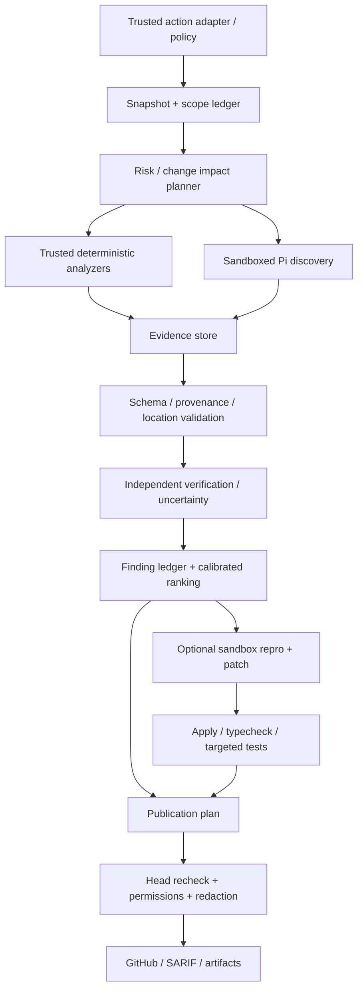

# Roadmap to an excellent reviewer and follow-on agent development

## 1. Verifiable product goals

The plan starts from baseline **`f59cfc34f385d89754814f7b3649b7004fe7faa4`, 09/12/2026**. The working tree has already partially implemented Phase A; the remaining features/gates are **not yet implemented or met**. [Audit and research sources](code-review-deep-research.md), [local witnesses](reproduction-results.json) are the basis before deciding on release.

## Current implementation update

This implementation round addressed high-impact false-clean paths and lost evidence: reviews retain all candidates before capping, incomplete/failed state is propagated to the summary and no approval is published, malformed verify/schema does not drop findings, unknown categories are not rewritten as correctness, the conflict resolver does not delete independent findings, Pi selects the last structured JSON message, timeouts cover both response body and process-group kill, Pi disables unreliable discovery, custom rules are forwarded, suggestions preserve code bytes exactly, sink comment/debug redaction is applied, quality gates check path/range, security conclusions and sticky summaries report engine failure, security dedupe passes the pull number, pagination reports `filesTruncated`, and prelint rejects non-executable binary candidates or symlinks escaping the checkout.

These changes have regression tests, `pnpm typecheck`, Biome, `pnpm test` (**48 files / 438 passing tests**), `pnpm build` for both entrypoints, and a smoke guard under `GITHUB_ACTIONS=true`. They do not prove quality against Copilot; the remaining items require benchmarking, a real sandbox, an evidence ledger, GraphQL lifecycle, and a verified-fix workflow before it can be called a competitor-beating release.

Proposed positioning: **a reviewer that finds regressions with evidence, explains briefly and accurately, checks patches in an isolated environment, preserves issue state across rounds, and gives development teams control over provider/cost/data**. It does not compete on comment count, long prompts, or agent count.

The first scope should be TypeScript/JavaScript + Node/React/Next/Nest and Python; confirm the ordering against target repositories. SQL/migrations should be a cross-stack domain. Keep Swift/Kotlin at best-effort support until there is a dedicated corpus, toolchain, and quality gates. Go/Java/C#/Rust are later expansions; do not advertise deep support before evaluation.

Two different goals need separate measurement: **code-review quality** versus Copilot code review; **issue→verified fix→PR** versus the Copilot cloud agent. The action does not need to recreate the full IDE/completion/chat ecosystem to win in the defined review task.

| Quality goal | Proposed release condition |
|---|---|
| Full features | Supported feature matrix has tests/integration/docs; no input silently ignored or profile silently downgraded |
| Outstanding review | Severe-finding precision/recall/evidence meet gates on holdout; clean PRs have few false blockers; no false-clean caused by pipeline errors |
| Able to surpass Copilot | Blind paired benchmark on the same snapshot/context/policy, pre-registered metrics; publish costs/latency and confidence intervals |
| Excellent product | Clear setup, honest summary, short actionable comments, reruns do not spam, failures are recoverable, human edits are protected |
| Able to stop one development round | No known P0/P1 remains in supported scope; all release gates pass; residual risks/version boundaries are documented |

“Stop” here means a release milestone, not a promise that the system will never need maintenance. Model/API/scanner/rules changes must pass evaluation before the next rollout.

## 2. Quality gates — goals, not existing measurements

The numbers below are **proposed thresholds for discussion and freezing before benchmarking**. There is no measured LLM quality baseline for the action yet; a baseline is needed to confirm budget/sampling and achievability. Do not mix seeded bugs with real defects to report an inflated recall.

| Gate | How to measure | Proposed release threshold |
|---|---|---|
| Safety | Adversarial workspace/resources/tools/credential sinks, process/network instrumentation | No unauthorized execution/secret egress on the defined corpus; 100% of mandatory cases pass |
| Completion truth | Fault injection: API/schema/refusal/context missing/scanner failed/stale head | 0 error cases reported as complete clean/approved; no issues dropped because of verification errors |
| Severe precision | Human-adjudicated high/critical findings, unique defects | Point estimate ≥98%; lower 95% confidence bound ≥95%; at least 300 adjudicated severe predictions or expand the sample |
| Known-defect recall | Adjudicated holdout ground truth, reported by stack/domain/severity | Seeded severe recall ≥80%; real known-defect recall has no regression; do not call this recall of all existing bugs |
| Evidence integrity | Blob/range/citation/proof checks | 100% of published anchors valid; ≥95% of actionable severe claims have concrete evidence; blocking claims must have an evidence gate |
| Clean PR false blocks | Human-checked negative corpus | Point estimate ≤1%; upper 95% CI ≤2%; at least 200 clean cases, grow the sample if power is insufficient |
| Suggestion safety | Exact patch apply + formatter/typecheck/target tests in sandbox | 100% of published replacements apply to the correct snapshot; verified-fix badge only when checks actually ran/passed |
| Review lifecycle | New/open/resolved/regressed/outdated across rounds | Target state accuracy ≥95%; never auto-resolve merely because a human clicked or the model stayed silent |
| Reliability | Fault-injected GitHub/gateway/tool errors, cancellation, rerun | No orphan processes in cancellation tests; idempotent reruns; failure/degraded state observable |
| Cost/latency | Actual usage + scanner/Actions costs, warm/cold runs separated | Enforced hard per-run budget; publish p50/p95 and USD/PR by preset/PR size; unknown costs remain unknown |
| UX | Maintainer pilot: relevance, clarity, actionability, setup/task success | ≥90% of comments rated actionable; acceptance is only a secondary metric, not a substitute for truth labels |

Confidence intervals must use appropriate sampling: finding precision uses binomial/Wilson as a descriptive summary, comparisons use paired bootstrap clustered by PR/repository. Multiple findings in one PR are not independent; do not take 300 comments from a few PRs to manufacture false confidence. Zero failures in a finite adversarial suite does not prove zero risk outside the suite.

### Conditions for claiming to “surpass Copilot”

Pre-register **severe known-defect recall** as the primary comparison; precision must pass its gate and be no more than 2 percentage points below baseline. Target a recall gain of at least **5 percentage points**, with the paired 95% CI of the difference above 0. Publish results by stack/PR size, not only in aggregate. Cost-matched comparison is primary; report quality-max comparison separately. Target p95 latency of no more than 1.25× baseline in the same tier, or explain what benefit the premium quality buys.

Without permission to measure the baseline, without enough sample, or without significant results, the conclusion must be **not yet proven**; do not change metrics after seeing results. The fix-agent benchmark has different measures: bug reproduction, patch correctness, regressions, test validity, PR usefulness, and execution rights; do not use review scores to infer that a code-fixing agent beats competitors.

## 3. Target architecture, incremental implementation

`cli.ts` becomes a thin adapter; review/security/fix become separate services sharing contracts. Pi keeps the agent loop; tool access, trusted resource discovery, and output protocol are host-controlled. No need to rewrite everything at once: change parser/status first, then context/ledger, then execution and publication services.

### Contracts needed before feature expansion

| Contract | Minimum data/semantics |
|---|---|
| `ReviewSnapshot` | base SHA, head SHA, checkout SHA, canonical repository root, collected-at, expected changed-file count |
| `ScopeLedger` | File/hunk: eligible, excluded-by-policy, no-patch, fetched, inspected, truncated/budget-limited, failed, unsupported; reason + bytes/tokens |
| `EngineExecution` | engine/model/prompt/rules digest, status complete/failed/refused/incomplete/skipped/degraded, error class, usage, retries, duration |
| `FindingCandidate` | host-generated ID, severity/category, claimed confidence, invariant/behavior change, base/head locations, evidence refs, assumptions, origin |
| `Evidence` | pinned blob hash/range/excerpt digest; analyzer rule/version/output hash; repro command policy/check result; do not use model self-claimed confirmation as proof |
| `VerificationVerdict` | candidate ID; supported/refuted/uncertain/error; evidence and reason; parse failure is not refuted |
| `FindingLedger` | candidate→valid→verified→published/suppressed/refuted state, dedupe/conflict reasons; full assessment retained despite UI cap |
| `PublicationPlan` | intended review/check/comment, actual status/IDs, expected SHA, trusted actor, idempotency key, redaction decision |
| `BudgetLedger` | token/cost/latency budget reserve, actual usage, cached/reasoning tokens, retry/tool overhead, estimated vs known cost |

Blocking is policy over **verified issues + complete mandatory assessment**. Findings and completeness coexist: an incomplete review can still find critical issues; do not delete findings to make status look better. Failures should prevent auto-approval; workflow exit/fail behavior must be configurable and documented for consumers.

## 4. Roadmap by dependency and effort

The estimates below are **person-weeks**, not calendar commitments. They assume a maintainer familiar with the repo, one implementing engineer plus a supporting reviewer; benchmark labeling/toolchain may be the bottleneck. Follow dependencies/gates; do not try to finish everything in one PR.

| Phase | Proposed effort | Outcome | Dependency / phase-transition condition |
|---|---|---|---|
| A — Trust and correctness | 2–4 person-weeks | Fix P0/P1 false-clean, sandbox/resource/env, parser/verifier, summary/redaction/cancellation | All mandatory adversarial/fault fixtures pass; existing public contracts unchanged |
| B — Evaluation and telemetry | 3–5 + labeling | Baseline replay, private holdout, usage/cost ledger, dashboard artifact | Frozen corpus/config, blinded labels, known failure baseline available; regressions can be caught |
| C — High-quality evidence/context | 4–7 | Change impact, selective retrieval, base/head citations, calibrated ranking, scanner/SCA integration | Ablation proves improvement in recall/precision and budget; no increase in false blocks |
| D — GitHub lifecycle and UX | 2–4 | GraphQL threads, SHA-safe publish, incremental rerun, no-spam, PR content protection | Sandbox integration matrix passes; pilot maintainers rate comments actionable |
| E — Verified fix agent | 5–9 | Repro-first patch, isolated tool execution, targeted tests, reviewable patch/PR handoff | A–D gates met; patch benchmark has no regression; capability policy clear |
| F — Scale/enterprise/expansion | 4–8 initial | Data controls, policy inheritance, audit/metrics, more stacks, release discipline | Demand/pilot and quality gates per capability exist; do not enable deep support by prompt alone |

Raw total effort is 20–37 person-weeks plus labeling/pilot; re-estimate after A/B. One implementation engineer should not promise a production-grade full feature in a few days. B can start building the corpus alongside A, but do not tune models on the holdout.

### Phase A — PRs to do first

| Proposed PR | Findings / changes | Tests and acceptance |
|---|---|---|
| `fix/trusted-pi-resources` | F01, unsafe security fallback; trusted loader/workspace, bundled skills allowlist, env/read path isolation | Extension/packages/system/ancestor-skill adversarial fixtures; tools cannot read credentials; builtin skills still work |
| `fix/trusted-analyzers` | F02; binary/config provenance, no PR install scripts, minimal env/sandbox | Workspace binaries rejected, trusted analyzer runs, required skip/error is not clean |
| `fix/structured-review-state` | F03/F08/F11/F12; terminal protocol/schema, per-engine health, explicit verify outcomes, async cleanup | Fault matrix malformed/refusal/truncation/multiturn/outage; preserve critical issues; no unhandled rejection |
| `fix/honest-review-summary` | F04/F13; completeness/publication separated, no invented rule passes | Snapshot tests failed/partial/clean/issues/stale/write-denied; file reason ledger |
| `fix/publication-integrity` | F05/F06/F09; exact suggestions + structured final redaction + host provenance | Byte roundtrip, secret canaries across all sinks, impossible anchors/forged evidence rejected |
| `fix/review-ranking-and-rules` | F07/F10/F17/F18; wire custom prompts, canonical enums, cap after validation, semantic identity | Input→Pi integration, independent add/remove, permuted findings, invalid prefix + late critical |
| `fix/transport-cancellation` | F16/F19; headers+body deadline, output caps, process-group termination, typed Pi args | Slow body, oversized payload, transient vs permanent retry, harmless ignore-SIGTERM descendant fixture |
| `test/release-quality-gates` | Required unit/type/lint/build/integration docs; deterministic artifact build | Build both shipped bundles; smoke invocation under Actions contract; fail on dist drift |

Each PR touching `src/` must include tests and docs in the same PR, Biome + strict TS, build both bundles with `pnpm build`, smoke-test before push per repository rules. Do not add co-author trailers or model names to PR title/body. Release workflows use a trusted ref; do not run PR code/dist with secrets to prove the PR itself safe.

## 5. Feature backlog: enough to become a product, not just a demo

| Feature | Concrete value | Acceptance / rollout | Priority |
|---|---|---|---|
| Honest assessment status | Readers know whether a review is complete or partial | Incomplete/failed/stale never approved; raw findings still retained | A |
| Reproducible evidence cards | Each issue has behavior change, trigger, impact, and proof | Blob/range valid; evidence provenance; assumptions visible; short prose | A/C |
| Safe custom review policy | Team rules actually applied | Trust level/version manifest; path-specific rules; wiring tests, no privilege escalation | A/C |
| Safe exact suggestions | Applying a fix does not corrupt code | Range/hash match; apply check; prose when uncertain | A/E |
| Confidence calibration | High confidence is measurably meaningful | Reliability plot/Brier/ECE by category; self-score is not confirmation | B/C |
| Budgeted review presets | Clear tradeoff choices | Fast/balanced/deep/verify have observable scope/budget, actual costs; no silent downgrade | B/C |
| Symbol/change-impact planner | Finds cross-file bugs instead of only the largest ones | Changed symbol→callers/contracts/tests; bounded graph; cross-file holdout improvement | C |
| Base/head semantic review | Distinguishes regressions from legacy behavior | Before/after invariant checks; separate advisory for existing bugs; no stale citations | C |
| Test intelligence | Missing-test claims are specific | Map changed behavior→existing assertions/coverage gaps; repro-first when needed | C/E |
| Security domain specialists | Auth/tenant/secrets/SSRF/path/SQL/migrations | Select the right domain and versions; threat-model evidence; separate precision gates | C |
| Full audit scope | Deep truly means beyond the diff | Full-repo file inventory/phases/errors; separate audit locations vs inline PR constraints | C |
| SAST/SCA/SARIF integration | Tools add evidence with provenance | Pinned analyzer/rules, lockfile-resolved advisories, native fingerprints, optional upload | C |
| Version-aware stacks | No API/rules suggestions for the wrong version | Read actual deps/toolchains; rules metadata with supported ranges; unsupported clearly marked | C/F |
| Incremental review | Reviewing new pushes is fast and never loses old issues | Compare last-reviewed SHA; revalidate impacted unresolved defects; new/resolved/regressed ledger | D |
| SHA-safe/no-spam GitHub publisher | Comments land on the right code without duplicates | Final SHA recheck, GraphQL pagination, trusted authorship, idempotent rerun | D |
| Follow-up/review reply workflow | Maintainers can ask about an issue with evidence | Opt-in trigger, actor authorization, current-code reread, concise answer, no embedded commands | D |
| Safe PR title/body assistant | Useful while preserving human edits | Managed section/preview, optimistic conflict check, preserve checklist/manual title policy | D |
| Draft/fork/large PR experience | Users know what the action does | Least privilege, explicit unsupported/queued/sliced scope, meaningful partial result | D |
| Verified fix workflow | Fixes bugs with proof | Failing repro on head→passing on patch; independent checks; patch scope limit | E |
| Issue→plan→patch handoff | End-to-end workflow like an agent | Plan + evidence + sandbox tools; reviewable diff; clear permission/publish policy | E |
| Controlled read-only MCP | Issue/spec/incident context with sources | Trusted server/tool allowlist, egress/credential separation, source refs, no arbitrary PR server startup | C/F |
| Privacy/provider presets | Use private repos/custom gateways with controls | Endpoint policy, no-secret-egress tests, retention docs, raw traces off by default | F |
| Enterprise policy/audit | Orgs know who enabled which permissions | Base-ref/admin policy inheritance, signed config/rule digest, auditable decisions | F |
| CLI/offline replay | Reproduce reviews outside GitHub | Same engine config snapshot, fixture replay, machine-readable report, exit semantics | B/F |
| Observability and release channels | Degradation/regression can be debugged | Trace IDs/usage/status, canary, rollback, benchmark-required model/rule upgrades | B/F |
| More languages/platforms | Expand once quality is measured | Corpus + toolchain + CI per stack; bounded support matrix | F |

Not every capability must be enabled by default. Review policy should not always auto-approve; approval only opt-in when completeness/evidence/permissions/head gates pass. Autofix should start with a local patch artifact, then opt-in PR publishing/handoff; write tools run in a separate environment with minimum privileges.

## 6. Evaluation design that avoids self-deception

### Dataset and ground truth

Proposed baseline corpus: **400 real PRs from ≥30 repositories**: 300 issue-bearing and 100 negative/clean, stratified by supported stacks, size, category, and severity. Add **120 adversarial/fault cases**, **60 multi-round trajectories**, and seeded mutations reported separately. Expand the clean corpus to ≥200 and severe predictions to sufficient sample when applying gates; do not force an underpowered dataset into strong conclusions.

Split by **repository + time + defect family**, not random comments: calibration/dev set, validation set, and private locked holdout. PR/review histories may already be in training data or leak answers; prefer new/private PRs where permitted, freeze head before human fixes. When cloning/recreating PRs to compare products, keep the necessary build context but do not feed ground-truth review comments into inputs. Only evaluators see ground truth/future fixes. Document what cannot be hidden from each product.

Two independent reviewers, blinded to product/model, adjudicate disagreements. Finding labels include: genuine defect, valid advisory, incorrect/noise, duplicate, unresolved/insufficient evidence. Record affected invariant, trigger, severity, new-vs-existing, location, and available proof. LLM judges only assist triage; they are never the sole ground truth. Human review can miss bugs, so “not matched to a historical comment” is not automatically a false positive; adjudicate new findings before scoring precision.

### Runs and comparison

Freeze action commit, bundled artifacts, Pi/scanner versions, model snapshot/provider, policy, prompt/rules digests, and budgets. For Copilot record product tier, review configuration, accessible context/skills/MCP, request/run time, and billing; do not assume hidden model identity is readable. Compare baseline action, repaired action, each ablation, and Copilot on the same head; repeat runs on a subset to measure stochastic variance. Do not use evaluator feedback as context for later rounds on holdout.

Use both cost-matched and quality-max runs, with warm/cold latency separated. Store **every raw normalized candidate with safe access**, verdict/suppression/cap reason, and final published findings. Scoring only published comments can “boost precision” by hiding every finding; therefore clean rate, recall, budget/completeness, and severe misses must be reported together.

### Required metrics

| Group | Metrics |
|---|---|
| Defect quality | Unique-defect precision/known recall, severe misses, per-domain/stack PR-size slices; new vs legacy |
| Noise/usefulness | False comments per PR, duplicate rate, advisory separated from blocking defects, human actionability; no-hit clean cases |
| Evidence | Valid citations, supported claims, actual repro checks, assumptions, location correctness |
| Verification | Supported/refuted/uncertain/error, false drops, gain/loss versus discovery; calibration |
| Lifecycle | New/open/resolved/regressed/outdated state accuracy; false resolution and repeated-comment rate |
| Fix | Repro validity, correct patch, regressions, test cheating/masking, apply rate, changed-line scope, maintainer acceptance |
| Operations | Completed/partial/failed/skipped, actual USD/input/output/cache/reasoning tokens, Actions/tool time, p50/p95, retries |
| Safety | Resource execution, credential/read boundaries, egress attempts, sink redaction, orphan processes, policy bypass |

### Ablations to run before adding agents

1. Diff-only vs selective retrieval vs full-content; record actual context bytes/tokens/inspected ranges.
2. Detected profiles vs all profiles; generic broad rules vs versioned high-signal domain rules.
3. Single discovery vs discovery+evidence verification; same-model vs different verifier, matched budget.
4. LLM alone vs analyzers/evidence; separate deterministic duplicates so they are not counted twice.
5. No memory vs explicit SHA-bound finding ledger in multi-round; do not use free-text memory as truth.
6. One model tier vs cost-aware risk routing; cheap passes must not suppress severe issues without proof.
7. Prompt-only confidence vs calibrated confidence; acceptance/resolution feedback is not itself a true label.

Keep a change only when it improves a pre-registered metric without breaking safety/precision/completeness gates. Ideas like “add five agents”, “deeper with more phases”, or “larger context” must pass the same ablation; they are not effective by default.

## 7. Presets, compatibility, and experience

Keep existing v1 inputs/defaults; fix bugs without changing public meaning except documented corrections. Add presets/config schema/versioned entries through additive interfaces allowed by contracts. The migration guide explains old defaults (critical-only/10 files/exclusions) and why new presets fit everyday review better.

| Proposed preset | Scope/behavior | Publication |
|---|---|---|
| Fast | Diff + minimum dependency/contract reads + trusted scanners, bounded budget | High signal; explicit coverage omissions; COMMENT default |
| Balanced | Selective callers/tests/config, structured evidence verification for high/critical | Full severe evidence gate, concise ranked comments |
| Deep | Change-impact graph + broader audit/repro where allowed, higher budget | Report full scope/phases; do not call it a full audit when only the diff was checked |
| Verify | Input candidate IDs + pinned evidence; no free discovery pretending to confirm | Supported/refuted/uncertain per ID |
| Fix | Separate isolated write environment, scoped patch + checks | Reviewable patch/PR opt-in; verified badge only with real proof |

Summaries should start with “What was checked / Any issues / What is still missing”, then the 3–5 highest-value findings with trigger/impact/evidence and next steps. Do not use a ten-category all-green table when the agent has not proven it assessed them. Error messages should say whether a rerun, missing tool, budget increase, or permission is needed; not just a stack trace. Keep raw sources/logs in a restricted artifact with retention; do not dump them on the PR.

## 8. Pilot, rollout, and exit point

Start in **shadow mode** on consenting repositories: no blocking/approving, collect labels and compare against human review. After safety/evidence gates, enable advisory comments on canaries; try blocking opt-in only when severe precision has enough power. Fixes start as local artifacts, then sandbox pilot and PR handoff per policy. Model/rule/scanner upgrades get frozen evaluation and rollback; provider outages never become clean.

The release milestone is complete when:

1. F01–F20 are fixed or have a bounded documented disposition accepted by maintainers; no P0/P1 blockers remain in supported scope.
2. Supported feature matrix, integration matrix, and quality gates pass; tests/build/smoke/docs share the same version; no silently ignored inputs.
3. Benchmark report includes configs, corpus/sampling/limitations, blinded adjudication, confidence intervals, cost/latency; competitive claims state only what was measured.
4. Pilot shows easy setup, actionable comments, reruns without spam, failure/stale/partial correctly understood; no overwriting of human content.
5. There are owners for eval/rules/security/dependencies, canary/rollback, data policies, and known residual risks.

At the audit snapshot, **these conditions are not yet met**. The most fitting execution step is Phase A, while building the baseline corpus for B. Only then will it be clear which context, model, verifier, or fix capabilities are needed for a real advantage.
